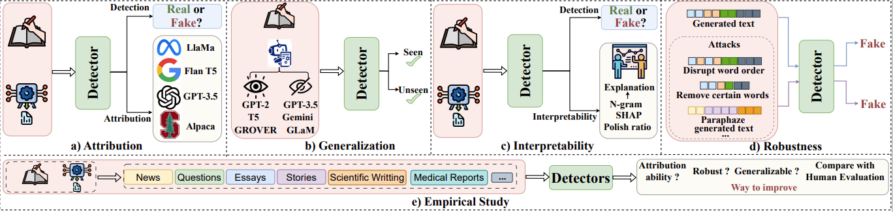

# Detect-LAM-generated-Multimedia-Survey

This repository contains a collection of resources and papers on ***Detecting Multimedia Generated by Large AI Models: A Survey***

<figure>
  
  <figcaption>A cat-and-mouse game between generating and detecting multimedia (<span style="color:textcolor;background-color: #97D077; padding: 2px 4px;">text</span>, <span style="color: imagecolor; background-color: #FF9999; padding: 2px 4px;">image</span>, <span style="color: videocolor; background-color: #FF8000; padding: 2px 4px;">video</span>, <span style="color: audiocolor; background-color: #CDA2BE; padding: 2px 4px;">audio</span>, and <span style="color: mmcolor; background-color: #FFCE9F; padding: 2px 4px;">multimodal</span>) using LAMs, showcasing only representative works. Q1 represents from Jan to Mar, Q2: Apr-Jun, Q3: Jul-Sep, Q4: Oct-Dec.</figcaption>
</figure>


Please let us know if you find out a mistake or have any suggestions by e-mail: lin1785@purdue.edu, hu968@purdue.edu, gupt1031@purdue.edu

If you find our survey useful for your research, please cite the following paper:

```
@article{Detect-LAM-Survey,
    title={Detecting Multimedia Generated by Large AI Models: A Survey},
    author={Staff},
    year={2023},
    journal={},
    url={}
}
```

## 💻 Contents
- [Related Works](https://github.com/Purdue-M2/Detect-LAM-generated-Multimedia-Survey/blob/main/README.md#related-works)
- [News articles](https://github.com/Purdue-M2/Detect-LAM-generated-Multimedia-Survey/blob/main/README.md#news-articles-necessitating-detection-of-lam-generated-multimedia)
- [Public Datasets for Detection](https://github.com/Purdue-M2/Detect-LAM-generated-Multimedia-Survey/blob/main/README.md#public-datasets-generated-by-lams)
- [Detection](https://github.com/Purdue-M2/Detect-LAM-generated-Multimedia-Survey/blob/main/README.md)
    - [Text](https://github.com/Purdue-M2/Detect-LAM-generated-Multimedia-Survey/blob/main/README.md#page_facing_up-text-)
        - [Pure Detection](https://github.com/Purdue-M2/Detect-LAM-generated-Multimedia-Survey/blob/main/README.md#pure-detection)
            - [Easy Explainable Methods](https://github.com/Purdue-M2/Detect-LAM-generated-Multimedia-Survey/blob/main/README.md#%EF%B8%8F-easy-explainable-methods)
                - [Watermarking](https://github.com/Purdue-M2/Detect-LAM-generated-Multimedia-Survey/blob/main/README.md#%EF%B8%8F-watermarking)
                - [Artifacts](https://github.com/Purdue-M2/Detect-LAM-generated-Multimedia-Survey/blob/main/README.md#%EF%B8%8F-artifacts)
                - [Stylometry/Coherence](https://github.com/Purdue-M2/Detect-LAM-generated-Multimedia-Survey/blob/main/README.md#%EF%B8%8F-stylometrycoherence)
            - [Hard Explainable Methods](https://github.com/Purdue-M2/Detect-LAM-generated-Multimedia-Survey/blob/main/README.md#%EF%B8%8F-hard-explainable-methods)
                - [Perplexity](https://github.com/Purdue-M2/Detect-LAM-generated-Multimedia-Survey/blob/main/README.md#%EF%B8%8F-perplexity)
                - [Log Probabilities Curvature](https://github.com/Purdue-M2/Detect-LAM-generated-Multimedia-Survey/blob/main/README.md#%EF%B8%8F-log-probabilities-curvature)
                - [Efficient Perturbations](https://github.com/Purdue-M2/Detect-LAM-generated-Multimedia-Survey/blob/main/README.md#%EF%B8%8F-efficient-perturbations)
        - [Beyond Detection](https://github.com/Purdue-M2/Detect-LAM-generated-Multimedia-Survey/blob/main/README.md#beyond-detection)
            - [Attribution](https://github.com/Purdue-M2/Detect-LAM-generated-Multimedia-Survey/blob/main/README.md#%EF%B8%8F-attribution)
                - [Deep-learning Based](https://github.com/Purdue-M2/Detect-LAM-generated-Multimedia-Survey/blob/main/README.md#%EF%B8%8F-deep-learning-based)
                - [Stylometric/Statistical](https://github.com/Purdue-M2/Detect-LAM-generated-Multimedia-Survey/blob/main/README.md#%EF%B8%8F-stylometricstatistical)
                - [Perplexity](https://github.com/Purdue-M2/Detect-LAM-generated-Multimedia-Survey/blob/main/README.md#%EF%B8%8F-perplexity-1)
                - [Origin Tracing](https://github.com/Purdue-M2/Detect-LAM-generated-Multimedia-Survey/blob/main/README.md#%EF%B8%8F-origin-tracing)
            - [Generalization](https://github.com/Purdue-M2/Detect-LAM-generated-Multimedia-Survey/blob/main/README.md#%EF%B8%8F-generalization)
                - [Structured Search](https://github.com/Purdue-M2/Detect-LAM-generated-Multimedia-Survey/blob/main/README.md#%EF%B8%8F-structured-search)
                - [Contrastive Learning](https://github.com/Purdue-M2/Detect-LAM-generated-Multimedia-Survey/blob/main/README.md#%EF%B8%8F-contrastive-learning)
            - [Interpretability](https://github.com/Purdue-M2/Detect-LAM-generated-Multimedia-Survey/blob/main/README.md#%EF%B8%8F-interpretability)
                - [N-gram Overlaps](https://github.com/Purdue-M2/Detect-LAM-generated-Multimedia-Survey/blob/main/README.md#%EF%B8%8F-n-gram-overlaps)
                - [P-values](https://github.com/Purdue-M2/Detect-LAM-generated-Multimedia-Survey/blob/main/README.md#%EF%B8%8F-p-values)
                - [Shapley Additive Explanations](https://github.com/Purdue-M2/Detect-LAM-generated-Multimedia-Survey/blob/main/README.md#%EF%B8%8F-shapley-additive-explanations)
                - [Shapley Additive Explanations](https://github.com/Purdue-M2/Detect-LAM-generated-Multimedia-Survey/blob/main/README.md#%EF%B8%8F-shapley-additive-explanations-1)
            - [Robustness](https://github.com/Purdue-M2/Detect-LAM-generated-Multimedia-Survey/blob/main/README.md#%EF%B8%8F-robustness)
                - [Adversarial Data Augmentation](https://github.com/Purdue-M2/Detect-LAM-generated-Multimedia-Survey/blob/main/README.md#%EF%B8%8F-adversarial-data-augmentation)
                - [Adversarial Learning](https://github.com/Purdue-M2/Detect-LAM-generated-Multimedia-Survey/blob/main/README.md#%EF%B8%8F-adversarial-learning)
                - [Stylistic/Consistency](https://github.com/Purdue-M2/Detect-LAM-generated-Multimedia-Survey/blob/main/README.md#%EF%B8%8F-stylisticconsistency)
            - [Empirical Study](https://github.com/Purdue-M2/Detect-LAM-generated-Multimedia-Survey/blob/main/README.md#%EF%B8%8F-empirical-study)
                - [Generalization/Robustness](https://github.com/Purdue-M2/Detect-LAM-generated-Multimedia-Survey/blob/main/README.md#%EF%B8%8F-generalizationrobustness)
                - [Human Evaluation](https://github.com/Purdue-M2/Detect-LAM-generated-Multimedia-Survey/blob/main/README.md#%EF%B8%8F-human-evaluation)
                - [Attribution](https://github.com/Purdue-M2/Detect-LAM-generated-Multimedia-Survey/blob/main/README.md#%EF%B8%8F-attribution-1)
                - [Paraphrase Detection](https://github.com/Purdue-M2/Detect-LAM-generated-Multimedia-Survey/blob/main/README.md#%EF%B8%8F-paraphrase-detection)
    - [Image](https://github.com/Purdue-M2/Detect-LAM-generated-Multimedia-Survey/blob/main/README.md#--image-)
        - [Pure Detection](https://github.com/Purdue-M2/Detect-LAM-generated-Multimedia-Survey/blob/main/README.md#pure-detection-1)
            - [Physical/Physiological based Methods](https://github.com/Purdue-M2/Detect-LAM-generated-Multimedia-Survey/blob/main/README.md#%EF%B8%8F-physicalphysiological-based-methods)
            - [Diffuser Fingerprints based Methods](https://github.com/Purdue-M2/Detect-LAM-generated-Multimedia-Survey/blob/main/README.md#%EF%B8%8F-diffuser-fingerprints-based-methods)
            - [Spatial-based Methods](https://github.com/Purdue-M2/Detect-LAM-generated-Multimedia-Survey/blob/main/README.md#%EF%B8%8F-spatial-based-methods)
            - [Frequency-based Methods](https://github.com/Purdue-M2/Detect-LAM-generated-Multimedia-Survey/blob/main/README.md#%EF%B8%8F-frequency-based-methods)
        - [Beyond Detection](https://github.com/Purdue-M2/Detect-LAM-generated-Multimedia-Survey/blob/main/README.md#beyond-detection-1)
            - [Attribution and Model Parsing](https://github.com/Purdue-M2/Detect-LAM-generated-Multimedia-Survey/blob/main/README.md#%EF%B8%8F-attribution-and-model-parsing)
                - [Attribution](https://github.com/Purdue-M2/Detect-LAM-generated-Multimedia-Survey/blob/main/README.md#%EF%B8%8F-attribution-2)
                - [Model Parsing](https://github.com/Purdue-M2/Detect-LAM-generated-Multimedia-Survey/blob/main/README.md#%EF%B8%8F-model-parsing-1)
            - [Generalization](https://github.com/Purdue-M2/Detect-LAM-generated-Multimedia-Survey/blob/main/README.md#%EF%B8%8F-generalization-1)
            - [Interpretability](https://github.com/Purdue-M2/Detect-LAM-generated-Multimedia-Survey/blob/main/README.md#%EF%B8%8F-interpretability-1)
            - [Localization](https://github.com/Purdue-M2/Detect-LAM-generated-Multimedia-Survey/blob/main/README.md#%EF%B8%8F-localization)
                - [Fully-supervised](https://github.com/Purdue-M2/Detect-LAM-generated-Multimedia-Survey/blob/main/README.md#%EF%B8%8F-fully-supervised)
                - [Weakly-supervised](https://github.com/Purdue-M2/Detect-LAM-generated-Multimedia-Survey/blob/main/README.md#%EF%B8%8F-weakly-supervised)
            - [Robustness](https://github.com/Purdue-M2/Detect-LAM-generated-Multimedia-Survey/blob/main/README.md#%EF%B8%8F-robustness-1)
                - [Spatial-based](https://github.com/Purdue-M2/Detect-LAM-generated-Multimedia-Survey/blob/main/README.md#%EF%B8%8F-spatial-based)
                - [Frequency-based](https://github.com/Purdue-M2/Detect-LAM-generated-Multimedia-Survey/blob/main/README.md#%EF%B8%8F-frequency-based)
            - [Empirical Study](https://github.com/Purdue-M2/Detect-LAM-generated-Multimedia-Survey/blob/main/README.md#%EF%B8%8F-empirical-study-1)
    - [Video](https://github.com/Purdue-M2/Detect-LAM-generated-Multimedia-Survey/blob/main/README.md#%EF%B8%8F-video)
        - [Beyond Detection](https://github.com/Purdue-M2/Detect-LAM-generated-Multimedia-Survey/blob/main/README.md#beyond-detection-2)
            - [Generalization](https://github.com/Purdue-M2/Detect-LAM-generated-Multimedia-Survey/blob/main/README.md#%EF%B8%8F-generalization-2)
    - [Audio](https://github.com/Purdue-M2/Detect-LAM-generated-Multimedia-Survey/blob/main/README.md#-audio)
        - [Pure Detection](https://github.com/Purdue-M2/Detect-LAM-generated-Multimedia-Survey/blob/main/README.md#pure-detection-2)
            - [Vocoder-based](https://github.com/Purdue-M2/Detect-LAM-generated-Multimedia-Survey/blob/main/README.md#%EF%B8%8F-vocoder-based)
    - [Multimodal](https://github.com/Purdue-M2/Detect-LAM-generated-Multimedia-Survey/blob/main/README.md#-multimodal)
        - [Pure Detection](https://github.com/Purdue-M2/Detect-LAM-generated-Multimedia-Survey/blob/main/README.md#pure-detection-3)
            - [Text-assisted](https://github.com/Purdue-M2/Detect-LAM-generated-Multimedia-Survey/blob/main/README.md#%EF%B8%8F-text-assisted)
            - [Text-image Inconsistency](https://github.com/Purdue-M2/Detect-LAM-generated-Multimedia-Survey/blob/main/README.md#%EF%B8%8F-text-image-inconsistency)
        - [Beyond Detection](https://github.com/Purdue-M2/Detect-LAM-generated-Multimedia-Survey/blob/main/README.md#beyond-detection-3)
            - [Attribution](https://github.com/Purdue-M2/Detect-LAM-generated-Multimedia-Survey/blob/main/README.md#%EF%B8%8F-attribution-3)
            - [Generalization](https://github.com/Purdue-M2/Detect-LAM-generated-Multimedia-Survey/blob/main/README.md#%EF%B8%8F-generalization-3)
                - [Prompt Tuning](https://github.com/Purdue-M2/Detect-LAM-generated-Multimedia-Survey/blob/main/README.md#%EF%B8%8F-prompt-tuning)
                - [Contrastive Learning](https://github.com/Purdue-M2/Detect-LAM-generated-Multimedia-Survey/blob/main/README.md#%EF%B8%8F-contrastive-learning-1)
            - [Interpretability](https://github.com/Purdue-M2/Detect-LAM-generated-Multimedia-Survey/blob/main/README.md#%EF%B8%8F-interpretability-2)
            - [Localization](https://github.com/Purdue-M2/Detect-LAM-generated-Multimedia-Survey/blob/main/README.md#%EF%B8%8F-localization-1)
                - [Spatial-based](https://github.com/Purdue-M2/Detect-LAM-generated-Multimedia-Survey/blob/main/README.md#%EF%B8%8F-spatial-based-1)
                - [Frequency-based](https://github.com/Purdue-M2/Detect-LAM-generated-Multimedia-Survey/blob/main/README.md#%EF%B8%8F-frequency-based-1)
            - [Empirical Study](https://github.com/Purdue-M2/Detect-LAM-generated-Multimedia-Survey/blob/main/README.md#%EF%B8%8F-empirical-study-2)
- [Detection Tools](https://github.com/Purdue-M2/Detect-LAM-generated-Multimedia-Survey/blob/main/README.md#detection-tools)

## 📈 Related Work

&nbsp;&nbsp;&nbsp;&nbsp;&nbsp;&nbsp;&nbsp;&nbsp; - A Survey on Detection of LLMs-Generated Content  [Paper](https://arxiv.org/pdf/2310.15654v1.pdf) [GitHub](https://github.com/xianjun-yang/awesome_papers_on_llms_detection)

&nbsp;&nbsp;&nbsp;&nbsp;&nbsp;&nbsp;&nbsp;&nbsp; - A Survey on LLM-generated Text Detection: Necessity, Methods, and Future Directions  [Paper](https://arxiv.org/abs/2310.14724) [GitHub](https://github.com/NLP2CT/LLM-generated-Text-Detection)

&nbsp;&nbsp;&nbsp;&nbsp;&nbsp;&nbsp;&nbsp;&nbsp; - Towards possibilities \& impossibilities of ai-generated text detection: A survey  [Paper](https://arxiv.org/pdf/2310.15264.pdf)

&nbsp;&nbsp;&nbsp;&nbsp;&nbsp;&nbsp;&nbsp;&nbsp; - Machine-generated text: A comprehensive survey of threat models and detection methods [Paper](https://ieeexplore.ieee.org/stamp/stamp.jsp?tp=&arnumber=10177704)

&nbsp;&nbsp;&nbsp;&nbsp;&nbsp;&nbsp;&nbsp;&nbsp; - The Age of Synthetic Realities: Challenges and Opportunities [Paper](https://arxiv.org/abs/2306.11503)

&nbsp;&nbsp;&nbsp;&nbsp;&nbsp;&nbsp;&nbsp;&nbsp; - GenAI against humanity: Nefarious applications of generative artificial intelligence and large language models [Paper](https://arxiv.org/abs/2310.00737)

## News articles necessitating detection of LAM-generated Multimedia
-----------

| **Sentiment** | **Category** | **Model** | **Article** | **Year** | **Publisher** | **Link** | 
|---------------|--------------|-----------|-------------|----------|---------------|----------|
| **Neutral**   |              | DMs       | How Is Everyone Making Those A.I. Selfies? | Dec 2022 | New York Times | [Link](https://www.nytimes.com/2022/12/07/style/lensa-ai-selfies.html) |
| **Neutral**   |              | DMs       | ChatGPT Can Now Generate Images, Too | Sep 2023 | New York Times | [Link](https://www.nytimes.com/2023/09/20/technology/chatgpt-dalle3-images-openai.html) | 
| **Neutral**   |              | DMs       | Can AI make photos of you look better than you do in real life? | Dec 2023 | Fox news | [Link](https://www.foxnews.com/tech/can-ai-make-photos-of-you-look-better-than-you-do-real-life) | 
| **Neutral**   |              | DMs, LLMs | This Robot Can Paint. But Is It Art? | May 2023 | New York Times | [Link](https://www.nytimes.com/2023/05/02/science/ai-creativity-paintbot.html) | 
| **Neutral**   |              | DMs, LLMs | A Coming-Out Party for Generative A.I., Silicon Valley’s New Craze | Oct 2022 | New York Times | [Link](https://www.nytimes.com/2022/10/21/technology/generative-ai.html) | 
| **Neutral**   |              | DMs, LLMs | How Easy Is It to Fool A.I.-Detection Tools? | Jun 2023 | New York Times | [Link](https://www.nytimes.com/interactive/2023/06/28/technology/ai-detection-midjourney-stable-diffusion-dalle.html) | 
| **Neutral**   |              | LLMs      | AI-generated kids' book using ChatGPT, Midjourney caught in art debate - The Washington Post | Jan 2023 | Washington Post | [Link](https://www.washingtonpost.com/technology/2023/01/19/ai-childrens-book-controversy-chatgpt-midjourney/) | 
| **Neutral**   |              | LLMs      | A disturbing AI phenomenon could completely upend the internet as we know it | Aug 2023 | Business Insider | [Link](https://www.businessinsider.com/ai-model-collapse-threatens-to-break-internet-2023-8) | 
| **Neutral**   |              | LLMs      | THE LLM DEEP FAKE—FOLLOW THE MONEY | Jun 2023 | Mind Matters | [Link](https://mindmatters.ai/2023/06/the-llm-deep-fake-follow-the-money/) | 
| **Neutral**   |              | LLMs      | A year of ChatGPT: 5 ways the AI marvel has changed the world | Nov 2023 | UNSW Newsroom | [Link](https://newsroom.unsw.edu.au/news/science-tech/year-chatgpt-5-ways-ai-marvel-has-changed-world) | 
| **Neutral**   |              | LLMs      | Verbal nonsense reveals limitations of AI chatbots | Sep 2023 | Science daily | [Link](https://www.sciencedaily.com/releases/2023/09/230914114704.htm) | 
| **Neutral**   |              | LLMs      | Pros and cons of ChatGPT plugin, Code Interpreter, in education, biology, health | Aug 2023 | Science daily | [Link](https://www.sciencedaily.com/releases/2023/08/230825122024.htm) | 
| **Neutral**   |              | LLMs      | Wikipedia’s Moment of Truth | Sep 2023 | New York Times | [Link](https://www.nytimes.com/2023/07/18/magazine/wikipedia-ai-chatgpt.html) | 
| **Neutral**   |              | LLMs      | A.I. Is Mastering Language. Should We Trust What It Says? | Apr 2022 | New York Times | [Link](https://www.nytimes.com/2022/04/15/magazine/ai-language.html) | 
| **Positive** | Research | DMs | A.I. Turns Its Artistry to Creating New Human Proteins | Jan 2023 | New York Times | [Link](https://www.nytimes.com/2023/01/09/science/artificial-intelligence-proteins.html) |
| **Positive** | Research | DMs, LLMs | We Need to Talk About How Good A.I. Is Getting | Aug 2022 | New York Times | [Link](https://www.nytimes.com/2022/08/24/technology/ai-technology-progress.html) |
| **Positive** | Research | LLMs | Chatbots might disrupt math and computer science classes. Some teachers see upsides | Oct 2023 | Ap news | [Link](https://apnews.com/article/chatgpt-math-computer-science-3fc4b72d69d34627ba3f2fa74491ea21) |
| **Positive** | Research | LLMs | An AI boost for developing new materials | Dec 2023 | Axios | [Link](https://www.axios.com/2023/12/02/ai-robotics-new-materials) |
| **Positive** | Research | LLMs | AI language models could help diagnose schizophrenia | Oct 2023 | Science daily | [Link](https://www.sciencedaily.com/releases/2023/10/231009191615.htm) |
| **Positive** | Research | LLMs | Brain signals transformed into speech through implants and AI | Aug 2023 | Science daily | [Link](https://www.sciencedaily.com/releases/2023/08/230828130347.htm) |
| **Positive** | Productivity | DMs | A.I.-Generated Art Is Already Transforming Creative Work | Oct 2022 | New York Times | [Link](https://www.nytimes.com/2022/10/21/technology/ai-generated-art-jobs-dall-e-2.html) |
| **Positive** | Productivity | DMs | A.I. May Help Design Your Favorite Video Game Character | May 2023 | New York Times | [Link](https://www.nytimes.com/2023/05/22/arts/blizzard-diffusion-ai-video-games.html) |
| **Positive** | Productivity | DMs | Meet DALL·E, the A.I. That Draws Anything at Your Command | Apr 2023 | New York Times | [Link](https://www.nytimes.com/2022/04/06/technology/openai-images-dall-e.html) |
| **Positive** | Productivity | DMs | Instant Videos Could Represent the Next Leap in A.I. Technology | Apr 2023 | New York Times | [Link](https://www.nytimes.com/2023/04/04/technology/runway-ai-videos.html) |
| **Positive** | Productivity | LLMs | Satya Nadella Says We are Moving from the AI Autopilot to Copilot Era with Humans in the Loop | May 2023 | Synthedia | [Link](https://synthedia.substack.com/p/satya-nadella-says-we-are-moving?utm_source=2Fsearch2Faffectsutm_medium=reader2) |
| **Positive** | Productivity | LLMs | The Chatbots Are Here, and the Internet Industry Is in a Tizzy | Mar 2022 | New York Times | [Link](https://www.nytimes.com/2023/03/08/technology/chatbots-disrupt-internet-industry.html) |
| **Negative** | Misinformation/Disinformation | DMs | How to detect deepfakes and other AI-generated media | May 2023 | Tech talks | [Link](https://bdtechtalks.com/2023/05/12/detect-deepfakes-ai-generated-media/) |
| **Negative** | Misinformation/Disinformation | DMs | People Are Creating Records of Fake Historical Events Using AI | Mar 2023 | Vice | [Link](https://www.vice.com/en/article/k7zqdw/people-are-creating-records-of-fake-historical-events-using-ai) |
| **Negative** | Misinformation/Disinformation | DMs | Can We No Longer Believe Anything We See? | Apr 2023 | New York Times | [Link](https://www.nytimes.com/2023/04/08/business/media/ai-generated-images.html) |
| **Negative** | Misinformation/Disinformation | DMs | Generative AI will create a 'tsunami of disinformation' during the 2024 election | Nov 2023 | Yahoo | [Link](https://finance.yahoo.com/news/generative-ai-will-create-a-tsunami-of-disinformation-during-the-2024-election-173001900.html) |
| **Negative** | Misinformation/Disinformation | DMs | Fact check: AI fakes in Israel's war against Hamas | Nov 2023 | DW | [Link](https://www.dw.com/en/fact-check-ai-fakes-in-israels-war-against-hamas/a-67367744) |
| **Negative** | Misinformation/Disinformation | DMs | As Deepfakes Flourish, Countries Struggle With Response | Jan 2023 | New York Times | [Link](https://www.nytimes.com/2023/01/22/business/media/deepfake-regulation-difficulty.html?searchResultPosition=1) |
| **Negative** | Misinformation/Disinformation | DMs, LLMs | GPT-powered deepfakes are a ‘powder keg’ | Feb 2023 | Fast company | [Link](https://www.fastcompany.com/90853542/deepfakes-getting-smarter-thanks-to-gpt) |
| **Negative** | Misinformation/Disinformation | DMs, LLMs | OPINION: AI has ushered in a formidable new frontier in contemporary warfare | Nov 2023 | Jewish News | [Link](https://www.jewishnews.co.uk/opinion-ai-has-ushered-in-a-formidable-new-frontier-in-contemporary-warfare/) |
| **Negative** | Misinformation/Disinformation | DMs, LLMs | Fake Or Fact? The Disturbing Future Of AI-Generated Realities | Jul 2023 | Forbes | [Link](https://www.forbes.com/sites/bernardmarr/2023/07/27/fake-or-fact-the-disturbing-future-of-ai-generated-realities/?sh=213abf8967d0) |
| **Negative** | Misinformation/Disinformation | LLMs | Dangerous chatbots: AI chatbots to be approved as medical devices? | Jul 2023 | Science daily | [Link](https://www.sciencedaily.com/releases/2023/07/230703133029.htm) |
| **Negative** | Misinformation/Disinformation | LLMs | Here’s What Happens When Your Lawyer Uses ChatGPT | May 2023 | New York Times | [Link](https://www.nytimes.com/2023/05/27/nyregion/avianca-airline-lawsuit-chatgpt.html?searchResultPosition=84) |
| **Negative** | Misinformation/Disinformation | LLMs | Despite OpenAI’s Promises, the Company’s New AI Tool Produces Misinformation More Frequently, and More Persuasively, than its Predecessor | Mar 2023 | News Guard | [Link](https://www.newsguardtech.com/misinformation-monitor/march-2023/) |
| **Negative** | Misinformation/Disinformation | LLMs | When A.I. Chatbots Hallucinate | May 2023 | New York Times | [Link](https://www.nytimes.com/2023/05/01/business/ai-chatbots-hallucination.html) |
| **Negative** | Misinformation/Disinformation | LLMs | Chatbots May ‘Hallucinate’ More Often Than Many Realize | Nov 2023 | New York Times | [Link](https://www.nytimes.com/2023/11/06/technology/chatbots-hallucination-rates.html) |
| **Negative** | Misinformation/Disinformation | LLMs | What Exactly Are the Dangers Posed by A.I.? | May 2023 | New York Times | [Link](https://www.nytimes.com/2023/05/01/technology/ai-problems-danger-chatgpt.html) |
| **Negative** | Misinformation/Disinformation | LLMs | Elon Musk and Others Call for Pause on A.I., Citing ‘Profound Risks to Society’ | Mar 2023 | New York Times | [Link](https://www.nytimes.com/2023/03/29/technology/ai-artificial-intelligence-musk-risks.html) |
| **Negative** | Misinformation/Disinformation | LLMs | Mushroom pickers urged to avoid foraging books on Amazon that appear to be written by AI | Sep 2023 | Guardian | [Link](https://www.theguardian.com/technology/2023/sep/01/mushroom-pickers-urged-to-avoid-foraging-books-on-amazon-that-appear-to-be-written-by-ai) |
| **Negative** | Misinformation/Disinformation | LLMs | Disinformation Researchers Raise Alarms About A.I. Chatbots | Jun 2023 | New York Times | [Link](https://www.nytimes.com/2023/02/08/technology/ai-chatbots-disinformation.html) |
| **Negative** | Misinformation/Disinformation | LLMs | What Happens When Robots Make Fake News? | Jul 2021 | Forbes | [Link](https://www.forbes.com/sites/helenleebouygues/2021/07/15/what-happens-when-robots-make-fake-news/?sh=454637fa7453) |
| **Negative** | Misinformation/Disinformation | LLMs | Biden to Issue First Regulations on Artificial Intelligence Systems | Oct 2023 | New York Times | [Link](https://www.nytimes.com/2023/10/30/us/politics/biden-artificial-intelligence.html?searchResultPosition=17) |
| **Negative** | Misinformation/Disinformation | LLMs | U.N. Officials Urge Regulation of Artificial Intelligence | Jul 2023 | New York Times | [Link](https://www.nytimes.com/2023/07/18/world/un-security-council-ai.html?searchResultPosition=21) |
| **Negative** | Economy | DMs | AI won an art contest, and artists are furious | Sep 2022 | CNN | [Link](https://www.cnn.com/2022/09/03/tech/ai-art-fair-winner-controversy/index.html) |
| **Negative** | Economy | DMs | "Art is dead Dude" - the rise of the AI artists stirs debate | Sep 2022 | BBC | [Link](https://www.bbc.com/news/technology-62788725) |
| **Negative** | Economy | DMs, LLMs | Sports Illustrated is the latest media company damaged by an AI experiment gone wrong | Nov 2023 | Ap news | [Link](https://apnews.com/article/journalists-ai-counterfeit-writers-479cc3869c0638df5bbb26d4b1e4f18f) |
| **Negative** | Economy | LLMs | Ridley Scott warns AI will be ‘technical hydrogen bomb’ in film industry | Dec 2023 | Fox news | [Link](https://www.foxnews.com/entertainment/ridley-scott-warns-ai-will-be-technical-hydrogen-bomb-in-film-industry) |
| **Negative** | Economy | LLMs | In Hollywood writers’ battle against AI, humans win (for now) | Sep 2023 | Ap news | [Link](https://apnews.com/article/hollywood-ai-strike-wga-artificial-intelligence-39ab72582c3a15f77510c9c30a45ffc8) |
| **Negative** | Ethics | DMs | India has a Deepfake Problem. But Is It A Crime? | Nov 2023 | Boom | [Link](https://www.boomlive.in/law/elections-pornography-laws-on-technology-deepfake-artificial-intelligence-23656) |
| **Negative** | Ethics | DMs | For teen girls victimized by ‘deepfake’ nude photos, there are few, if any, pathways to recourse in most states | Nov 2023 | NBC | [Link](https://www.nbcnews.com/news/us-news/little-recourse-teens-girls-victimized-ai-deepfake-nudes-rcna126399) |
| **Negative** | Ethics | DMs | The Race to Prevent ‘the Worst Case Scenario for Machine Learning’ | Jun 2023 | New York Times | [Link](https://www.nytimes.com/2023/06/24/business/ai-generated-explicit-images.html) |
| **Negative** | Ethics | DMs | ‘Is It Good Enough to Fool My Gallerist?’ | Sep 2023 | New York Times | [Link](https://www.nytimes.com/interactive/2023/09/22/arts/design/david-salle-ai.html) |
| **Negative** | Ethics | DMs | The Alt-Right Manipulated My Comic. Then A.I. Claimed It. | Dec 2022 | New York Times | [Link](https://www.nytimes.com/2022/12/31/opinion/sarah-andersen-how-algorithim-took-my-work.html) |
| **Negative** | Ethics | DMs | This Tool Could Protect Artists From A.I.-Generated Art That Steals Their Style | Feb 2023 | New York Times | [Link](https://www.nytimes.com/2023/02/13/technology/ai-art-generator-lensa-stable-diffusion.html) |
| **Negative** | Ethics | DMs | HUMANS ARE BIASED. GENERATIVE AI IS EVEN WORSE | June 2023 | Bloomberg | [Link](https://www.bloomberg.com/graphics/2023-generative-ai-bias/) |
| **Negative** | Ethics | DMs | People think white AI-generated faces are more real than actual photos, study says | Nov 2023 | Ars Technica | [Link](https://arstechnica.com/information-technology/2023/11/people-think-white-ai-generated-faces-are-more-real-than-actual-photos-study-says/) |
| **Negative** | Ethics | LLMs | Was that essay written by AI? A student made an app that might tell you. | Jan 2023 | Washington Post | [Link](https://www.washingtonpost.com/education/2023/01/12/gptzero-chatgpt-detector-ai/) |
| **Negative** | Ethics | LLMs | Generative AI: A Blessing or a Curse for Cybersecurity? | May 2023 | inWeb3 | [Link](https://www.inweb3.com/generative-ai-a-blessing-or-a-curse-for-cybersecurity/) |


##  Public Datasets for Detection

| **Modality** | **Dataset** | **Content** | **Link** | **I2O** | **#Real** | **#Generated** | **Source of Real Media** | **Generation Method** | **Year** |
|--------------|-------------|-------------|----------|---------|-----------|----------------|--------------------------|-----------------------|----------|
| **Text** | Student Essays | Essays | [Link](https://github.com/vivek3141/ghostbuster) | T2T | 1,000 | 6,000 | IvyPanda | ChatGPT | 2023 |
| **Text** | Creative Writing | Essays | [Link](https://github.com/vivek3141/ghostbuster) | T2T | 1,000 | 6,000 | Reddit WritingPrompts | ChatGPT | 2023 |
| **Text** | News Articles | Essays | [Link](https://github.com/vivek3141/ghostbuster) | T2T | 1,000 | 6,000 | Reuters 50-50 | ChatGPT | 2023 |
| **Text** | Paraphrase | Essays | [Link](https://huggingface.co/datasets/jpwahle/autoregressive-paraphrase-dataset) | T2T | 98,280 | 163,710 | Arxiv, Wikipedia, Theses | GPT-3, T5 | 2022 |
| **Text** | Authorship Attribution | Essays | [Link](https://github.com/AdaUchendu/Authorship-Attribution-for-Neural-Text-Generation/tree/master/data) | T2T | 1,064 | 8,512 | News Media | Various GPT, CTRL, GROVER, etc. | 2020 |
| **Text** | OUTFOX | Essays | [Link](https://github.com/ryuryukke/OUTFOX) | T2T | 15,400 | 15,400 | Feedback Prize | ChatGPT, GPT-3.5, T5 | 2023 |
| **Text** | MULTITuDE | News | [Link](https://zenodo.org/records/10013755) | T2T | 7,992 | 66,089 | MassiveSumm | GPT-3, GPT-4, ChatGPT | 2023 |
| **Text** | TuringBench | News | [Link](https://turingbench.ist.psu.edu/) | T2T | 8,854 | 159,758 | News Media | Various GPT, CTRL, GROVER, etc. | 2021 |
| **Text** | GPT-3.5 unmixed | News | [Link](https://huggingface.co/datasets/ZachW/MGTDetect_CoCo) | T2T | 5,454 | 5,454 | News Media | GPT-3.5 | 2023 |
| **Text** | GPT-3.5 mixed | News | [Link](https://huggingface.co/datasets/ZachW/MGTDetect_CoCo) | T2T | 5,032 | 5,032 | News Media | GPT-3.5 | 2023 |
| **Text** | GPABenchmark | Writing | [Link](https://github.com/liuzey/CheckGPT) | T2T | 150,000 | 450,000 | Arxiv | GPT-3.5 | 2023 |
| **Text** | HPPT | Abstracts | [Link](https://github.com/FreedomIntelligence/ChatGPT-Detection-PR-HPPT) | T2T | 6,050 | 6,050 | ACL Anthology | ChatGPT | 2023 |
| **Text** | TweepFake | Tweets | [Link](https://github.com/tizfa/tweepfake_deepfake_text_detection) | T2T | 12,786 | 12,786 | GitHub, Twitter | GPT-2, RNN, LSTM | 2021 |
| **Text** | SynSciPass | Passages | [Link](https://github.com/domenicrosati/synscipass/tree/main/SynSciPass) | T2T | 99,989 | 10,485 | Scientific papers | GPT-2, BLOOM | 2022 |
| **Text** | Deepfake-TextDetect | General | [Link](https://github.com/yafuly/DeepfakeTextDetect) | T2T | 154,078 | 294,381 | Various sources including Reddit, ELI5, Yelp, etc. | Various including GPT, GLM, LLaMA, T5, OPT | 2022 |
| **Text** | HC-Var | General | [Link](https://huggingface.co/datasets/hannxu/hc_var) | T2T | 90,096 | 45,000 | Various including XSum, IMDb, Yelp, Reddit, etc. | ChatGPT | 2023 |
| **Text** | HC3 | General | [Link](https://huggingface.co/datasets/Hello-SimpleAI/HC3) | T2T | 26,903 | 58,546 | Various including FiQA, Wiki, ELI5, etc. | ChatGPT | 2023 |
| **Text** | M4 | General | [Link](https://github.com/mbzuai-nlp/M4) | T2T | 32,798 | 89,683 | Various including Wikipedia, WikiHow, Arxiv, etc. | Various including ChatGPT, GTP-3.5, LLaMA, T5, Dolly-v2, etc. | 2023 |
| **Text** | InternVid | Captions | [Link](https://github.com/OpenGVLab/InternVideo/tree/main/Data/InternVid) | V2T | 7,000,000 | 234,000,000 | YouTube | ViCLIP | 2023 |
| **Image** | DFF | Face | [Link](https://huggingface.co/datasets/OpenRL/DeepFakeFace) | T2I/I2I | 30,000 | 90,000 | IMDB-WIKI | SDMs, InsightFace | 2023 |
| **Image** | RealFaces | Face | [Link](https://github.com/LucaCorvitto/RealFaces_w_StableDiffusion) | T2I | 258 | 25,800 | Prompts | SDMs | 2023 |
| **Image** | OverheadImg | Overhead | [Link](https://stresearch.github.io/synthetic-overhead-dataset/) | T2I/I2I | 6,475 | 6,675 | MapBox, Google Maps | GLIDE, DDPM | 2023 |
| **Image** | GenImage | General | [Link](https://github.com/GenImage-Dataset/GenImage) | T2I/I2I | 1,331,167 | 1,350,000 | ImageNet | Various methods including SDMs, Midjourney, BigGAN, VQDM | 2023 |
| **Image** | CIFAKE | General | [Link](https://www.kaggle.com/datasets/birdy654/cifake-real-and-ai-generated-synthetic-images) | T2I | 60,000 | 60,000 | CIFAR-10 | SD-V1.4 | 2023 |
| **Image** | AutoSplice | General | [Link](https://github.com/shanface33/AutoSplice_Dataset) | T2I | 2,273 | 3,621 | Visual News | DALL·E-2 | 2023 |
| **Image** | DiffusionDB | General | [Link](https://huggingface.co/datasets/poloclub/diffusiondb) | T2I | 3,300,000 | 16,000,000 | DiscordChatExporter | SD | 2023 |
| **Image** | ArtiFact | General | [Link](https://www.kaggle.com/datasets/awsaf49/artifact-dataset) | T2I/I2I | 964,989 | 1,531,749 | Various sources including AFHQ, CelebAHQ, COCO, etc. | Various methods including SDMs, VQDM, DDPM, LDM, etc. | 2023 |
| **Image** | HiFi-IFDL | General | [Link](https://github.com/CHELSEA234/HiFi_IFDL) | T2I/I2I | ~600,000 | 1,300,000 | Various sources including FFHQ, AFHQ, CelebAHQ, etc. | Various methods including DDPM, DDIM, GLIDE, LDM, etc. | 2023 |
| **Image** | DiffusionForensics | General | [Link](https://github.com/ZhendongWang6/DIRE) | T2I/I2I | 232,000 | 232,000 | LSUN, ImageNet | Various methods including LDM, DDPM, iDDPM, VQDM, ADM, PNDM | 2023 |
| **Image** | CocoGlide | General | [Link](https://github.com/grip-unina/TruFor) | T2I | 512 | 512 | COCO | GLIDE | 2023 |
| **Image** | Western Blot | General | [Link](https://www.dropbox.com/sh/nl3txxfovy97b1k/AABqb-gkGBEfjS6pjke3a-d7a?dl=0) | I2I | ~14,000 | ~24,000 | Western Blot | DDPM, Pix2pix, CycleGAN | 2022 |
| **Image** | LSUNDB | General | [Link](https://zenodo.org/records/7528113) | T2I/I2I | 250,000 | 250,000 | LSUN | Various methods including DDPM, PNDM, LDM, ADM, ProjectedGAN, StyleGAN, DiffusionGAN | 2023 |
| **Image** | UniversalFake | General | [Link](https://drive.google.com/file/d/1FXlGIRh_Ud3cScMgSVDbEWmPDmjcrm1t/view) | T2I | 8,000 | 8,000 | LAION-400M | LDM, GLIDE | 2023 |
| **Image** | REGM | General | [Link](https://drive.google.com/file/d/1bAmC_9aMkWJB_scGvOOWvNeLa9FBoMUr/view) | T2I/I2I | - | 116,000 | CelebA, LSUN | 116 publicly available GMs | 2023 |
| **Image** | DMimage | General | [Link](https://github.com/grip-unina/DMimageDetection) | T2I | 200,000 | 200,000 | COCO, LSUN | LDM | 2022 |
| **Image** | AIGCD | General | [Link](https://github.com/Ekko-zn/AIGCDetectBenchmark) | T2I/I2I | 360,000 | 508,500 | Various sources including LSUN, ImageNet, CelebA, COCO, FFHQ | Various methods including SDMs, GANs, Midjourney, VQDM, ADM, DALL·E-2, GLIDE, WFIR, Wukong | 2023 |
| **Image** | DIF | General | [Link](https://github.com/sergo2020/dif_pytorch_official) | T2I/I2I | 84,300 | 84,300 | LAION-5B | Various methods including SDMs, DALL·E-2, Midjourney, GLIDE, GANs | 2023 |
| **Image** | Fake2M | General | [Link](https://github.com/Inf-imagine/Sentry) | T2I/I2I | - | 2,300,000 | CC3M | SD-V1.5, IF, StyleGAN3 | 2023 |
| **Video** | Diffused-head | Face | [Link](https://drive.google.com/file/d/1zWSqtV7O4WGkgh6WB55b8Mdg2lXXUudH/view) | I.A2V | - | 820 | CREMA | Diffused Heads: build on DDPM | 2023 |
| **Audio** | LibriSeVoc | Speech | [Link](https://drive.google.com/file/d/1NXF9w0YxzVjIAwGm_9Ku7wfLHVbsT7aG/view) | T2A | 13,201 | 79,206 | LibriTTS | Various methods including DiffWave, WaveNet, WaveRNN, Mel-GAN, WaveGrad | 2023 |
| **Multi-modal** | $DGM^4$ | News | [Link](https://github.com/rshaojimmy/MultiModal-DeepFake) | T2T/I2I | 77,426 | 152,574 | Visual News | Various methods including B-GST, StyleCLIP, HFGI, InfoSwap, SimSwap | 2023 |
| **Multi-modal** | COCOFake | General | [Link](https://github.com/aimagelab/ELSA_COCO-Fake) | T2T/T2I | 113,287 | 566,435 | COCO | SDMs | 2023 |


## :mag_right: Detection :fire:

### <p align="center">:page_facing_up: Text </p>
-----------
### Pure Detection

<figure>
  
  <figcaption style="text-align: center;">Illustrations of text pure detection methodologies.</figcaption>
</figure>

#### &nbsp;&nbsp;♣️ Easy Explainable Methods
##### &nbsp;&nbsp;&nbsp;&nbsp;&nbsp;&nbsp;&nbsp;&nbsp;▶️ Watermarking

&nbsp;&nbsp;&nbsp;&nbsp;&nbsp;&nbsp;&nbsp;&nbsp; - Distillation-Resistant Watermarking for Model Protection in NLP  [Paper](https://aclanthology.org/2022.findings-emnlp.370.pdf)

&nbsp;&nbsp;&nbsp;&nbsp;&nbsp;&nbsp;&nbsp;&nbsp; - Three bricks to consolidate watermarks for large language models  [Paper](https://arxiv.org/abs/2308.00113) [GitHub](https://github.com/facebookresearch/three_bricks)

&nbsp;&nbsp;&nbsp;&nbsp;&nbsp;&nbsp;&nbsp;&nbsp; - Robust multi-bit natural language watermarking through invariant features  [Paper](https://aclanthology.org/2023.acl-long.117.pdf)

&nbsp;&nbsp;&nbsp;&nbsp;&nbsp;&nbsp;&nbsp;&nbsp; - Undetectable Watermarks for Language Models  [Paper](https://arxiv.org/pdf/2306.09194.pdf)

&nbsp;&nbsp;&nbsp;&nbsp;&nbsp;&nbsp;&nbsp;&nbsp; - Robust distortion-free watermarks for language models  [Paper](https://arxiv.org/abs/2307.15593)

&nbsp;&nbsp;&nbsp;&nbsp;&nbsp;&nbsp;&nbsp;&nbsp; - Provable robust watermarking for ai-generated text  [Paper](https://arxiv.org/abs/2306.17439) [GitHub](https://github.com/XuandongZhao/Unigram-Watermark)

&nbsp;&nbsp;&nbsp;&nbsp;&nbsp;&nbsp;&nbsp;&nbsp; - A Private Watermark for Large Language Models  [Paper](https://arxiv.org/abs/2307.16230v2)
    
    
##### &nbsp;&nbsp;&nbsp;&nbsp;&nbsp;&nbsp;&nbsp;&nbsp;▶️ Artifacts
    
&nbsp;&nbsp;&nbsp;&nbsp;&nbsp;&nbsp;&nbsp;&nbsp; - Unraveling the mystery of artifacts in machine generated text  [Paper](https://aclanthology.org/2022.lrec-1.744.pdf)
    
    
##### &nbsp;&nbsp;&nbsp;&nbsp;&nbsp;&nbsp;&nbsp;&nbsp;▶️ Stylometry/Coherence
    
&nbsp;&nbsp;&nbsp;&nbsp;&nbsp;&nbsp;&nbsp;&nbsp; - Stylometric detection of ai-generated text in twitter timelines  [Paper](https://arxiv.org/abs/2303.03697)

&nbsp;&nbsp;&nbsp;&nbsp;&nbsp;&nbsp;&nbsp;&nbsp; - CoCo: Coherence-Enhanced Machine-Generated Text Detection Under Data Limitation With Contrastive Learning [Paper](https://aclanthology.org/2023.emnlp-main.1005/)


#### &nbsp;&nbsp;♣️ Hard Explainable Methods
##### &nbsp;&nbsp;&nbsp;&nbsp;&nbsp;&nbsp;&nbsp;&nbsp;▶️ Perplexity

&nbsp;&nbsp;&nbsp;&nbsp;&nbsp;&nbsp;&nbsp;&nbsp; - HowkGPT: Investigating the Detection of ChatGPT-generated University Student Homework through Context-Aware Perplexity Analysis  [Paper](https://arxiv.org/abs/2305.18226)

&nbsp;&nbsp;&nbsp;&nbsp;&nbsp;&nbsp;&nbsp;&nbsp; - GPTZero [Tool](https://gptzero.me/)


##### &nbsp;&nbsp;&nbsp;&nbsp;&nbsp;&nbsp;&nbsp;&nbsp;▶️ Log Probabilities Curvature

&nbsp;&nbsp;&nbsp;&nbsp;&nbsp;&nbsp;&nbsp;&nbsp; - Detectgpt: Zero-shot machine-generated text detection using probability curvature [Paper](https://dl.acm.org/doi/10.5555/3618408.3619446) [GitHub](https://github.com/eric-mitchell/detect-gpt)


##### &nbsp;&nbsp;&nbsp;&nbsp;&nbsp;&nbsp;&nbsp;&nbsp;▶️ Efficient Perturbations

&nbsp;&nbsp;&nbsp;&nbsp;&nbsp;&nbsp;&nbsp;&nbsp; - Efficient Detection of LLM-generated Texts with a Bayesian Surrogate Model [Paper](https://arxiv.org/abs/2305.16617)

&nbsp;&nbsp;&nbsp;&nbsp;&nbsp;&nbsp;&nbsp;&nbsp; - Fast-DetectGPT: Efficient Zero-Shot Detection of Machine-Generated Text via Conditional Probability Curvature [Paper](https://arxiv.org/abs/2310.05130)

&nbsp;&nbsp;&nbsp;&nbsp;&nbsp;&nbsp;&nbsp;&nbsp; - DetectLLM: Leveraging Log Rank Information for Zero-Shot Detection of Machine-Generated Text [Paper](https://arxiv.org/abs/2306.05540) [GitHub](https://github.com/mbzuai-nlp/DetectLLM)


### Beyond Detection

<figure>
  
  <figcaption style="text-align: center;">Illustrations of text beyond detection methodologies.</figcaption>
</figure>

#### &nbsp;&nbsp;♣️ Attribution
##### &nbsp;&nbsp;&nbsp;&nbsp;&nbsp;&nbsp;&nbsp;&nbsp;▶️ Deep-learning Based


&nbsp;&nbsp;&nbsp;&nbsp;&nbsp;&nbsp;&nbsp;&nbsp; - TURINGBENCH: A Benchmark Environment for Turing Test in the Age of Neural Text Generation [Paper](https://arxiv.org/abs/2109.13296) [Turingbench](https://turingbench.ist.psu.edu/)

&nbsp;&nbsp;&nbsp;&nbsp;&nbsp;&nbsp;&nbsp;&nbsp; - Whodunit? Learning to Contrast for Authorship Attribution [Paper](https://arxiv.org/abs/2209.11887)

&nbsp;&nbsp;&nbsp;&nbsp;&nbsp;&nbsp;&nbsp;&nbsp; - Through the looking glass: Learning to attribute synthetic text generated by language models [Paper](https://aclanthology.org/2021.eacl-main.155.pdf)

&nbsp;&nbsp;&nbsp;&nbsp;&nbsp;&nbsp;&nbsp;&nbsp; - TopRoBERTa: Topology-Aware Authorship Attribution of Deepfake Texts [Paper](https://arxiv.org/pdf/2309.12934.pdf)


##### &nbsp;&nbsp;&nbsp;&nbsp;&nbsp;&nbsp;&nbsp;&nbsp;▶️ Stylometric/Statistical

&nbsp;&nbsp;&nbsp;&nbsp;&nbsp;&nbsp;&nbsp;&nbsp; - Authorship attribution for neural text generation [Paper](https://aclanthology.org/2020.emnlp-main.673.pdf) [GitHub](https://github.com/AdaUchendu/Authorship-Attribution-for-Neural-Text-Generation)

&nbsp;&nbsp;&nbsp;&nbsp;&nbsp;&nbsp;&nbsp;&nbsp; - Gpt-who: An information density-based machine-generated text detector [Paper](https://arxiv.org/pdf/2310.06202.pdf)


##### &nbsp;&nbsp;&nbsp;&nbsp;&nbsp;&nbsp;&nbsp;&nbsp;▶️ Perplexity

&nbsp;&nbsp;&nbsp;&nbsp;&nbsp;&nbsp;&nbsp;&nbsp; - LLMDet: A Third Party Large Language Models Generated Text Detection Tool [Paper](https://arxiv.org/abs/2305.15004) [GitHub](https://github.com/TrustedLLM/LLMDet)


##### &nbsp;&nbsp;&nbsp;&nbsp;&nbsp;&nbsp;&nbsp;&nbsp;▶️ Origin Tracing

&nbsp;&nbsp;&nbsp;&nbsp;&nbsp;&nbsp;&nbsp;&nbsp; - Origin Tracing and Detecting of LLMs [Paper](https://arxiv.org/abs/2304.14072)


#### &nbsp;&nbsp;♣️ Generalization
##### &nbsp;&nbsp;&nbsp;&nbsp;&nbsp;&nbsp;&nbsp;&nbsp;▶️ Structured Search

&nbsp;&nbsp;&nbsp;&nbsp;&nbsp;&nbsp;&nbsp;&nbsp; - Ghostbuster: Detecting Text Ghostwritten by Large Language Models [Paper](https://arxiv.org/abs/2305.15047)


##### &nbsp;&nbsp;&nbsp;&nbsp;&nbsp;&nbsp;&nbsp;&nbsp;▶️ Contrastive Learning

&nbsp;&nbsp;&nbsp;&nbsp;&nbsp;&nbsp;&nbsp;&nbsp; - Conda: Contrastive domain adaptation for ai-generated text detection [Paper](https://arxiv.org/abs/2309.03992) [GitHub](https://github.com/AmritaBh/ConDA-gen-text-detection)


#### &nbsp;&nbsp;♣️ Interpretability
##### &nbsp;&nbsp;&nbsp;&nbsp;&nbsp;&nbsp;&nbsp;&nbsp;▶️ N-gram Overlaps

&nbsp;&nbsp;&nbsp;&nbsp;&nbsp;&nbsp;&nbsp;&nbsp; - DNA-GPT: Divergent N-Gram Analysis for Training-Free Detection of GPT-Generated Text [Paper](https://arxiv.org/abs/2305.17359) [GitHub](https://github.com/Xianjun-Yang/DNA-GPT)


##### &nbsp;&nbsp;&nbsp;&nbsp;&nbsp;&nbsp;&nbsp;&nbsp;▶️ P-values

&nbsp;&nbsp;&nbsp;&nbsp;&nbsp;&nbsp;&nbsp;&nbsp; - A Watermark for Large Language Models [Paper](https://arxiv.org/abs/2301.10226) [GitHub](https://github.com/jwkirchenbauer/lm-watermarking)


##### &nbsp;&nbsp;&nbsp;&nbsp;&nbsp;&nbsp;&nbsp;&nbsp;▶️ Shapley Additive Explanations

&nbsp;&nbsp;&nbsp;&nbsp;&nbsp;&nbsp;&nbsp;&nbsp; - Chatgpt or human? detect and explain. explaining decisions of machine learning model for detecting short chatgpt-generated text [Paper](https://arxiv.org/abs/2301.13852)

&nbsp;&nbsp;&nbsp;&nbsp;&nbsp;&nbsp;&nbsp;&nbsp; - Check Me If You Can: Detecting ChatGPT-Generated Academic Writing using CheckGPT [Paper](https://arxiv.org/abs/2306.05524)


##### &nbsp;&nbsp;&nbsp;&nbsp;&nbsp;&nbsp;&nbsp;&nbsp;▶️ Shapley Additive Explanations

&nbsp;&nbsp;&nbsp;&nbsp;&nbsp;&nbsp;&nbsp;&nbsp; - Is chatgpt involved in texts? measure the polish ratio to detect chatgpt-generated text [Paper](https://arxiv.org/pdf/2307.11380.pdf#:~:text=PR%3A%20Polish%20Ratio%20is%20a,and%20the%20corresponding%20polished%20texts.)


#### &nbsp;&nbsp;♣️ Robustness
##### &nbsp;&nbsp;&nbsp;&nbsp;&nbsp;&nbsp;&nbsp;&nbsp;▶️ Adversarial Data Augmentation

&nbsp;&nbsp;&nbsp;&nbsp;&nbsp;&nbsp;&nbsp;&nbsp; - Is chatgpt involved in texts? measure the polish ratio to detect chatgpt-generated text [Paper](https://arxiv.org/pdf/2307.11380.pdf#:~:text=PR%3A%20Polish%20Ratio%20is%20a,and%20the%20corresponding%20polished%20texts.)

&nbsp;&nbsp;&nbsp;&nbsp;&nbsp;&nbsp;&nbsp;&nbsp; - Red Teaming Language Model Detectors with Language Models [Paper](https://arxiv.org/abs/2305.19713)

&nbsp;&nbsp;&nbsp;&nbsp;&nbsp;&nbsp;&nbsp;&nbsp; - MGTBench: Benchmarking Machine-Generated Text Detection [Paper](https://arxiv.org/abs/2303.14822) [GitHub](https://github.com/xinleihe/MGTBench)


##### &nbsp;&nbsp;&nbsp;&nbsp;&nbsp;&nbsp;&nbsp;&nbsp;▶️ Adversarial Learning

&nbsp;&nbsp;&nbsp;&nbsp;&nbsp;&nbsp;&nbsp;&nbsp; - Radar: Robust ai-text detection via adversarial learning [Paper](https://arxiv.org/abs/2307.03838) [Project Page](https://radar.vizhub.ai/)

&nbsp;&nbsp;&nbsp;&nbsp;&nbsp;&nbsp;&nbsp;&nbsp; - Outfox: Llm-generated essay detection through in-context learning with adversarially generated examples [Paper](https://arxiv.org/abs/2307.11729)


##### &nbsp;&nbsp;&nbsp;&nbsp;&nbsp;&nbsp;&nbsp;&nbsp;▶️ Stylistic/Consistency

&nbsp;&nbsp;&nbsp;&nbsp;&nbsp;&nbsp;&nbsp;&nbsp; - J-guard: Journalism guided adversarially robust detection of ai-generated news [Paper](https://arxiv.org/abs/2309.03164)

&nbsp;&nbsp;&nbsp;&nbsp;&nbsp;&nbsp;&nbsp;&nbsp; - Intrinsic Dimension Estimation for Robust Detection of AI-Generated Texts [Paper](https://arxiv.org/abs/2306.04723)


#### &nbsp;&nbsp;♣️ Empirical Study
##### &nbsp;&nbsp;&nbsp;&nbsp;&nbsp;&nbsp;&nbsp;&nbsp;▶️ Generalization/Robustness

&nbsp;&nbsp;&nbsp;&nbsp;&nbsp;&nbsp;&nbsp;&nbsp; - ChatLog: Recording and Analyzing ChatGPT Across Time [Paper](https://arxiv.org/abs/2304.14106) [GitHub](https://github.com/THU-KEG/ChatLog)

&nbsp;&nbsp;&nbsp;&nbsp;&nbsp;&nbsp;&nbsp;&nbsp; - On the Zero-Shot Generalization of Machine-Generated Text Detectors [Paper](https://arxiv.org/abs/2310.05165)

&nbsp;&nbsp;&nbsp;&nbsp;&nbsp;&nbsp;&nbsp;&nbsp; - On the Generalization of Training-based ChatGPT Detection Methods [Paper](https://arxiv.org/pdf/2310.01307.pdf)

&nbsp;&nbsp;&nbsp;&nbsp;&nbsp;&nbsp;&nbsp;&nbsp; - Supervised Machine-Generated Text Detectors: Family and Scale Matters [Paper](https://link.springer.com/chapter/10.1007/978-3-031-42448-9_11) [GitHub](https://github.com/symanto-research/supervised-mgt-family-scale)

&nbsp;&nbsp;&nbsp;&nbsp;&nbsp;&nbsp;&nbsp;&nbsp; - Deepfake Text Detection in the Wild [Paper](https://arxiv.org/abs/2305.13242) [GitHub](https://github.com/yafuly/DeepfakeTextDetect)


##### &nbsp;&nbsp;&nbsp;&nbsp;&nbsp;&nbsp;&nbsp;&nbsp;▶️ Human Evaluation

&nbsp;&nbsp;&nbsp;&nbsp;&nbsp;&nbsp;&nbsp;&nbsp; - How close is chatgpt to human experts? comparison corpus, evaluation, and detection [Paper](https://arxiv.org/abs/2301.07597) [GitHub](https://github.com/Hello-SimpleAI/chatgpt-comparison-detection)


##### &nbsp;&nbsp;&nbsp;&nbsp;&nbsp;&nbsp;&nbsp;&nbsp;▶️ Attribution

&nbsp;&nbsp;&nbsp;&nbsp;&nbsp;&nbsp;&nbsp;&nbsp; - From Text to Source: Results in Detecting Large Language Model-Generated Content [Paper](https://arxiv.org/abs/2309.13322)


##### &nbsp;&nbsp;&nbsp;&nbsp;&nbsp;&nbsp;&nbsp;&nbsp;▶️ Paraphrase Detection

&nbsp;&nbsp;&nbsp;&nbsp;&nbsp;&nbsp;&nbsp;&nbsp; - How large language models are transforming machine-paraphrased plagiarism  [Paper](https://arxiv.org/abs/2210.03568)

&nbsp;&nbsp;&nbsp;&nbsp;&nbsp;&nbsp;&nbsp;&nbsp; - Paraphrase Detection: Human vs. Machine Content [Paper](https://arxiv.org/abs/2303.13989)


### <p align="center"> 📸 Image </p>
-----------
###  Pure Detection
#### &nbsp;&nbsp;♣️ Physical/Physiological based Methods

&nbsp;&nbsp;&nbsp;&nbsp;&nbsp;&nbsp;&nbsp;&nbsp; - Qualitative Failures of Image Generation Models and Their Application in Detecting Deepfakes [Paper](https://arxiv.org/abs/2304.06470)

&nbsp;&nbsp;&nbsp;&nbsp;&nbsp;&nbsp;&nbsp;&nbsp; - Perspective (in) consistency of paint by text [Paper](https://arxiv.org/abs/2206.14617)

&nbsp;&nbsp;&nbsp;&nbsp;&nbsp;&nbsp;&nbsp;&nbsp; - Lighting (in) consistency of paint by text [Paper](https://arxiv.org/abs/2207.13744)


#### &nbsp;&nbsp;♣️ Diffuser Fingerprints based Methods

&nbsp;&nbsp;&nbsp;&nbsp;&nbsp;&nbsp;&nbsp;&nbsp; - Deep Image Fingerprint: Accurate And Low Budget Synthetic Image Detector [Paper](https://arxiv.org/abs/2303.10762)

&nbsp;&nbsp;&nbsp;&nbsp;&nbsp;&nbsp;&nbsp;&nbsp; - DIRE for Diffusion-Generated Image Detection [Paper](https://arxiv.org/abs/2303.09295) [GitHub](https://github.com/ZhendongWang6/DIRE)

&nbsp;&nbsp;&nbsp;&nbsp;&nbsp;&nbsp;&nbsp;&nbsp; - Exposing the Fake: Effective Diffusion-Generated Images Detection [Paper](https://arxiv.org/abs/2307.06272)


#### &nbsp;&nbsp;♣️ Spatial-based Methods

&nbsp;&nbsp;&nbsp;&nbsp;&nbsp;&nbsp;&nbsp;&nbsp; - Rich and Poor Texture Contrast: A Simple yet Effective Approach for AI-generated Image Detection [Paper](https://arxiv.org/abs/2311.12397) [Project Page](https://fdmas.github.io/AIGCDetect/)

&nbsp;&nbsp;&nbsp;&nbsp;&nbsp;&nbsp;&nbsp;&nbsp; - Unmasking The Artist: Discriminating Human-Drawn And AI-Generated Human Face Art Through Facial Feature Analysis [Paper](https://ieeexplore.ieee.org/stamp/stamp.jsp?tp=&arnumber=10289113)

&nbsp;&nbsp;&nbsp;&nbsp;&nbsp;&nbsp;&nbsp;&nbsp; - Detecting images generated by deep diffusion models using their local intrinsic dimensionality [Paper](https://openaccess.thecvf.com/content/ICCV2023W/DFAD/papers/Lorenz_Detecting_Images_Generated_by_Deep_Diffusion_Models_Using_Their_Local_ICCVW_2023_paper.pdf) 


#### &nbsp;&nbsp;♣️ Frequency-based Methods

&nbsp;&nbsp;&nbsp;&nbsp;&nbsp;&nbsp;&nbsp;&nbsp; - Wavelet-packets for deepfake image analysis and detection [Paper](https://arxiv.org/abs/2106.09369) [GitHub](https://github.com/gan-police/frequency-forensics)

&nbsp;&nbsp;&nbsp;&nbsp;&nbsp;&nbsp;&nbsp;&nbsp; - AUSOME: authenticating social media images using frequency analysis [Paper](https://www.spiedigitallibrary.org/conference-proceedings-of-spie/12542/2663296/AUSOME-authenticating-social-media-images-using-frequency-analysis/10.1117/12.2663296.full#_=_)

&nbsp;&nbsp;&nbsp;&nbsp;&nbsp;&nbsp;&nbsp;&nbsp; - AI-Generated Image Detection using a Cross-Attention Enhanced Dual-Stream Network [Paper](https://arxiv.org/abs/2306.07005)

&nbsp;&nbsp;&nbsp;&nbsp;&nbsp;&nbsp;&nbsp;&nbsp; - Synthbuster: Towards Detection of Diffusion Model Generated Images [Paper](https://ieeexplore.ieee.org/stamp/stamp.jsp?tp=&arnumber=10334046)


### Beyond Detection
#### &nbsp;&nbsp;♣️ Attribution and Model Parsing
##### &nbsp;&nbsp;&nbsp;&nbsp;&nbsp;&nbsp;&nbsp;&nbsp;▶️ Attribution

&nbsp;&nbsp;&nbsp;&nbsp;&nbsp;&nbsp;&nbsp;&nbsp; - Level up the deepfake detection: a method to effectively discriminate images generated by gan architectures and diffusion models [Paper](https://arxiv.org/abs/2303.00608)


##### &nbsp;&nbsp;&nbsp;&nbsp;&nbsp;&nbsp;&nbsp;&nbsp;▶️ Model Parsing

&nbsp;&nbsp;&nbsp;&nbsp;&nbsp;&nbsp;&nbsp;&nbsp; - Reverse engineering of generative models: Inferring model hyperparameters from generated images [Paper](https://www.computer.org/csdl/journal/tp/5555/01/10202583/1PhSMobmlUs)


#### &nbsp;&nbsp;♣️ Generalization

&nbsp;&nbsp;&nbsp;&nbsp;&nbsp;&nbsp;&nbsp;&nbsp; - Online Detection of AI-Generated Images [Paper](https://openaccess.thecvf.com/content/ICCV2023W/DFAD/papers/Epstein_Online_Detection_of_AI-Generated_Images__ICCVW_2023_paper.pdf)

&nbsp;&nbsp;&nbsp;&nbsp;&nbsp;&nbsp;&nbsp;&nbsp; - Towards universal fake image detectors that generalize across generative models [Paper](https://openaccess.thecvf.com/content/CVPR2023/papers/Ojha_Towards_Universal_Fake_Image_Detectors_That_Generalize_Across_Generative_Models_CVPR_2023_paper.pdf) [GitHub](https://github.com/Yuheng-Li/UniversalFakeDetect)

&nbsp;&nbsp;&nbsp;&nbsp;&nbsp;&nbsp;&nbsp;&nbsp; - Raising the Bar of AI-generated Image Detection with CLIP [Paper](https://arxiv.org/abs/2312.00195)

&nbsp;&nbsp;&nbsp;&nbsp;&nbsp;&nbsp;&nbsp;&nbsp; - Transcending Forgery Specificity with Latent Space Augmentation for Generalizable Deepfake Detection [Paper](https://arxiv.org/abs/2311.11278)

&nbsp;&nbsp;&nbsp;&nbsp;&nbsp;&nbsp;&nbsp;&nbsp; - Fingerprintnet: Synthesized fingerprints for generated image detection [Paper](https://link.springer.com/chapter/10.1007/978-3-031-19781-9_5)

&nbsp;&nbsp;&nbsp;&nbsp;&nbsp;&nbsp;&nbsp;&nbsp; - Detecting Deepfakes Without Seeing Any [Paper](https://arxiv.org/abs/2311.01458) [GitHub](https://github.com/talreiss/FACTOR)

&nbsp;&nbsp;&nbsp;&nbsp;&nbsp;&nbsp;&nbsp;&nbsp; - Improving Synthetically Generated Image Detection in Cross-Concept Settings [Paper](https://dl.acm.org/doi/fullHtml/10.1145/3592572.3592846)

&nbsp;&nbsp;&nbsp;&nbsp;&nbsp;&nbsp;&nbsp;&nbsp; - Diffusion Noise Feature: Accurate and Fast Generated Image Detection [Paper](https://arxiv.org/abs/2312.02625#:~:text=Diffusion%20Noise%20Feature%3A%20Accurate%20and%20Fast%20Generated%20Image%20Detection,-Yichi%20Zhang%2C%20Xiaogang&text=Generative%20models%20have%20reached%20an,disseminating%20false%20or%20misleading%20information.)


#### &nbsp;&nbsp;♣️ Interpretability

&nbsp;&nbsp;&nbsp;&nbsp;&nbsp;&nbsp;&nbsp;&nbsp; - Interpretable-through-prototypes deepfake detection for diffusion models [Paper](https://openaccess.thecvf.com/content/ICCV2023W/DFAD/papers/Aghasanli_Interpretable-Through-Prototypes_Deepfake_Detection_for_Diffusion_Models_ICCVW_2023_paper.pdf) [GitHub](https://github.com/lira-centre/DeepfakeDetection)


#### &nbsp;&nbsp;♣️ Localization
##### &nbsp;&nbsp;&nbsp;&nbsp;&nbsp;&nbsp;&nbsp;&nbsp;▶️ Fully-supervised

&nbsp;&nbsp;&nbsp;&nbsp;&nbsp;&nbsp;&nbsp;&nbsp; - Hierarchical fine-grained image forgery detection and localization [Paper](https://openaccess.thecvf.com/content/CVPR2023/papers/Guo_Hierarchical_Fine-Grained_Image_Forgery_Detection_and_Localization_CVPR_2023_paper.pdf) [GitHub](https://github.com/CHELSEA234/HiFi_IFDL)

&nbsp;&nbsp;&nbsp;&nbsp;&nbsp;&nbsp;&nbsp;&nbsp; - Perceptual Artifacts Localization for Image Synthesis Tasks [Paper](https://openaccess.thecvf.com/content/ICCV2023/papers/Zhang_Perceptual_Artifacts_Localization_for_Image_Synthesis_Tasks_ICCV_2023_paper.pdf) [GitHub](https://github.com/owenzlz/PAL4VST)

&nbsp;&nbsp;&nbsp;&nbsp;&nbsp;&nbsp;&nbsp;&nbsp; - TruFor: Leveraging all-round clues for trustworthy image forgery detection and localization [Paper](https://openaccess.thecvf.com/content/CVPR2023/papers/Guillaro_TruFor_Leveraging_All-Round_Clues_for_Trustworthy_Image_Forgery_Detection_and_CVPR_2023_paper.pdf) [GitHub](https://github.com/grip-unina/TruFor)


##### &nbsp;&nbsp;&nbsp;&nbsp;&nbsp;&nbsp;&nbsp;&nbsp;▶️ Weakly-supervised

&nbsp;&nbsp;&nbsp;&nbsp;&nbsp;&nbsp;&nbsp;&nbsp; - Weakly-supervised deepfake localization in diffusion-generated images  [Paper](https://openaccess.thecvf.com/content/WACV2024/html/Tantaru_Weakly-Supervised_Deepfake_Localization_in_Diffusion-Generated_Images_WACV_2024_paper.html)


#### &nbsp;&nbsp;♣️ Robustness
##### &nbsp;&nbsp;&nbsp;&nbsp;&nbsp;&nbsp;&nbsp;&nbsp;▶️ Spatial-based

&nbsp;&nbsp;&nbsp;&nbsp;&nbsp;&nbsp;&nbsp;&nbsp; - Unveiling the Impact of Image Transformations on Deepfake Detection: An Experimental Analysis  [Paper](https://link.springer.com/chapter/10.1007/978-3-031-43153-1_29)

&nbsp;&nbsp;&nbsp;&nbsp;&nbsp;&nbsp;&nbsp;&nbsp; - GLFF: Global and Local Feature Fusion for AI-synthesized Image Detection  [Paper](https://ieeexplore.ieee.org/abstract/document/10246417)

&nbsp;&nbsp;&nbsp;&nbsp;&nbsp;&nbsp;&nbsp;&nbsp; - Exposing fake images generated by text-to-image diffusion models  [Paper](https://www.sciencedirect.com/science/article/abs/pii/S0167865523002933)

&nbsp;&nbsp;&nbsp;&nbsp;&nbsp;&nbsp;&nbsp;&nbsp; - Local Statistics for Generative Image Detection  [Paper](https://arxiv.org/abs/2310.16684)


##### &nbsp;&nbsp;&nbsp;&nbsp;&nbsp;&nbsp;&nbsp;&nbsp;▶️ Frequency-based

&nbsp;&nbsp;&nbsp;&nbsp;&nbsp;&nbsp;&nbsp;&nbsp; - D4: Detection of Adversarial Diffusion Deepfakes Using Disjoint Ensembles [Paper](https://openaccess.thecvf.com/content/WACV2024/supplemental/Hooda_D4_Detection_of_WACV_2024_supplemental.pdf)


#### &nbsp;&nbsp;♣️ Empirical Study

&nbsp;&nbsp;&nbsp;&nbsp;&nbsp;&nbsp;&nbsp;&nbsp; - On the detection of synthetic images generated by diffusion models [Paper](https://ieeexplore.ieee.org/stamp/stamp.jsp?arnumber=10095167) [GitHub](https://github.com/grip-unina/DMimageDetection)

&nbsp;&nbsp;&nbsp;&nbsp;&nbsp;&nbsp;&nbsp;&nbsp; - Intriguing properties of synthetic images: from generative adversarial networks to diffusion models [Paper](https://openaccess.thecvf.com/content/CVPR2023W/WMF/papers/Corvi_Intriguing_Properties_of_Synthetic_Images_From_Generative_Adversarial_Networks_to_CVPRW_2023_paper.pdf)

&nbsp;&nbsp;&nbsp;&nbsp;&nbsp;&nbsp;&nbsp;&nbsp; - Towards the detection of diffusion model deepfakes [Paper](https://arxiv.org/abs/2210.14571)

&nbsp;&nbsp;&nbsp;&nbsp;&nbsp;&nbsp;&nbsp;&nbsp; - On the use of Stable Diffusion for creating realistic faces: from generation to detection [Paper](https://ieeexplore.ieee.org/document/10156981)

&nbsp;&nbsp;&nbsp;&nbsp;&nbsp;&nbsp;&nbsp;&nbsp; - Finding AI-Generated Faces in the Wild [Paper](https://arxiv.org/abs/2311.08577)

&nbsp;&nbsp;&nbsp;&nbsp;&nbsp;&nbsp;&nbsp;&nbsp; - Forensic analysis of synthetically generated western blot images [Paper](https://ieeexplore.ieee.org/stamp/stamp.jsp?arnumber=9785655)

&nbsp;&nbsp;&nbsp;&nbsp;&nbsp;&nbsp;&nbsp;&nbsp; - Beyond Human Forgeries: An Investigation into Detecting Diffusion-Generated Handwriting [Paper](https://link.springer.com/chapter/10.1007/978-3-031-41498-5_1)


### <p align="center">🎞️ Video</p>
-----------
### Beyond Detection
#### &nbsp;&nbsp;♣️ Generalization

&nbsp;&nbsp;&nbsp;&nbsp;&nbsp;&nbsp;&nbsp;&nbsp; - Revisiting Generalizability in Deepfake Detection: Improving Metrics and Stabilizing Transfer  [Paper](https://openaccess.thecvf.com/content/ICCV2023W/DFAD/papers/Kamat_Revisiting_Generalizability_in_Deepfake_Detection_Improving_Metrics_and_Stabilizing_Transfer_ICCVW_2023_paper.pdf)


### <p align="center">🎵 Audio</p>
-----------
### Pure Detection
#### &nbsp;&nbsp;♣️ Vocoder-based

&nbsp;&nbsp;&nbsp;&nbsp;&nbsp;&nbsp;&nbsp;&nbsp; - AI-Synthesized Voice Detection Using Neural Vocoder Artifacts [Paper](https://openaccess.thecvf.com/content/CVPR2023W/WMF/papers/Sun_AI-Synthesized_Voice_Detection_Using_Neural_Vocoder_Artifacts_CVPRW_2023_paper.pdf) [GitHub](https://github.com/csun22/Synthetic-Voice-Detection-Vocoder-Artifacts)


### <p align="center">🍯 Multimodal</p>
-----------
### Pure Detection
#### &nbsp;&nbsp;♣️ Text-assisted

&nbsp;&nbsp;&nbsp;&nbsp;&nbsp;&nbsp;&nbsp;&nbsp; - Parents and Children: Distinguishing Multimodal DeepFakes from Natural Images [Paper](https://arxiv.org/abs/2304.00500)


#### &nbsp;&nbsp;♣️ Text-image Inconsistency

&nbsp;&nbsp;&nbsp;&nbsp;&nbsp;&nbsp;&nbsp;&nbsp; - Detecting cross-modal inconsistency to defend against neural fake news [Paper](https://aclanthology.org/2020.emnlp-main.163.pdf) [GitHub](https://github.com/rxtan2/DIDAN/)
 

### Beyond Detection
#### &nbsp;&nbsp;♣️ Attribution

&nbsp;&nbsp;&nbsp;&nbsp;&nbsp;&nbsp;&nbsp;&nbsp; - De-fake: Detection and attribution of fake images generated by text-to-image generation models [Paper](https://dl.acm.org/doi/10.1145/3576915.3616588)


#### &nbsp;&nbsp;♣️ Generalization
##### &nbsp;&nbsp;&nbsp;&nbsp;&nbsp;&nbsp;&nbsp;&nbsp;▶️ Prompt Tuning

&nbsp;&nbsp;&nbsp;&nbsp;&nbsp;&nbsp;&nbsp;&nbsp; - AntifakePrompt: Prompt-Tuned Vision-Language Models are Fake Image Detectors [Paper](https://arxiv.org/abs/2310.17419) [GitHub](https://github.com/nctu-eva-lab/AntifakePrompt)


##### &nbsp;&nbsp;&nbsp;&nbsp;&nbsp;&nbsp;&nbsp;&nbsp;▶️ Contrastive Learning

&nbsp;&nbsp;&nbsp;&nbsp;&nbsp;&nbsp;&nbsp;&nbsp; - Generalizable Synthetic Image Detection via Language-guided Contrastive Learning [Paper](https://arxiv.org/abs/2305.13800) [GitHub](https://github.com/HighwayWu/LASTED)


#### &nbsp;&nbsp;♣️ Interpretability

&nbsp;&nbsp;&nbsp;&nbsp;&nbsp;&nbsp;&nbsp;&nbsp; - Combating Misinformation in the Era of Generative AI Models [Paper](https://dl.acm.org/doi/10.1145/3581783.3612704)


#### &nbsp;&nbsp;♣️ Localization
##### &nbsp;&nbsp;&nbsp;&nbsp;&nbsp;&nbsp;&nbsp;&nbsp;▶️ Spatial-based

&nbsp;&nbsp;&nbsp;&nbsp;&nbsp;&nbsp;&nbsp;&nbsp; - Detecting and grounding multi-modal media manipulation [Paper](https://openaccess.thecvf.com/content/CVPR2023/papers/Shao_Detecting_and_Grounding_Multi-Modal_Media_Manipulation_CVPR_2023_paper.pdf)

&nbsp;&nbsp;&nbsp;&nbsp;&nbsp;&nbsp;&nbsp;&nbsp; - Exploiting Modality-Specific Features For Multi-Modal Manipulation Detection And Grounding [Paper](https://arxiv.org/pdf/2309.12657v1.pdf)


##### &nbsp;&nbsp;&nbsp;&nbsp;&nbsp;&nbsp;&nbsp;&nbsp;▶️ Frequency-based

&nbsp;&nbsp;&nbsp;&nbsp;&nbsp;&nbsp;&nbsp;&nbsp; - Unified Frequency-Assisted Transformer Framework for Detecting and Grounding Multi-Modal Manipulation [Paper](https://arxiv.org/abs/2309.09667)


#### &nbsp;&nbsp;♣️ Empirical Study

&nbsp;&nbsp;&nbsp;&nbsp;&nbsp;&nbsp;&nbsp;&nbsp; - Detecting Images Generated by Diffusers [Paper](https://arxiv.org/abs/2303.05275) [GitHub](https://github.com/davide-coccomini/Detecting-Images-Generated-by-Diffusers)


## Detection Tools

| Modality                           | Tool                                      | Company            | Link                                                                                                         |
| ---------------------------------- | ----------------------------------------- | ------------------ | ------------------------------------------------------------------------------------------------------------ |
| **Text**                           | AI Content Detector                       | Copyleaks          | [Link](https://copyleaks.com/ai-content-detector)                                                            |
|    **Text**                                  | AI Content Detector, ChatGPT detector     | ZeroGPT            | [Link](https://zerogpt.net/zerogpt-results)                                                                  |
|        **Text**                              | AI Content Detector                       | Winston AI         | [Link](https://gowinston.ai/)                                                                                |
|      **Text**                                | AI Content Detector                       | Crossplag           | [Link](https://crossplag.com/ai-content-detector/)                                                           |
|      **Text**                                | Giant Language model Test Room            | GLTR               | [Link](http://gltr.io/)                                                                                      |
|      **Text**                                | The AI Detector                           | Content at Scale   | [Link](https://contentatscale.ai/ai-content-detector/)                                                      |
|      **Text**                                | AI Checker                                | Originality ai     | [Link](https://originality.ai/)                                                                             |
|      **Text**                                | Advanced AI Detector and Humanizer        | Undetectable ai     | [Link](https://undetectable.ai/)                                                                            |
|       **Text**                               | AI Content Detector                       | Writer              | [Link](https://writer.com/ai-content-detector/)                                                             |
|        **Text**                              | AI Content Detector                       | Conch               | [Link](https://www.getconch.ai/)                                                                            |
|        **Text**                              | Illuminarty Text                          | Illuminarty         | [Link](https://app.illuminarty.ai/#/text)                                                                   |
|     **Text**       | AI-Generated Text Detector                | Is it AI            | [Link](https://isitai.com/ai-text-detector/)                                                                |
| **Image**                          | AI or Not image                           | AI or Not           | [Link](https://www.aiornot.com/)                                                                            |
|       **Image**                             | AI-Generated Image Detector               | Is it AI            | [Link](https://isitai.com/ai-image-detector/)                                                               |
|       **Image**                             | Illuminarty Image                         | Illuminarty         | [Link](https://app.illuminarty.ai/#/image)                                                                  |
|        **Image**                            | SynthID                                   | Google              | [Link](https://deepmind.google/discover/blog/identifying-ai-generated-images-with-synthid/)                |
|            **Image**                        | Advanced AI Image Detector                | Content at Scale    | [Link](https://contentatscale.ai/ai-image-detector/)                                                       |
|    **Image**     | AI Image Detector                         | Huggingface         | [Link](https://huggingface.co/spaces/Phantom3306/AI-image-detector)                                       |
| **Audio**                          | AI or Not audio                           | AI or Not           | [Link](https://www.aiornot.com/)                                                                            |
