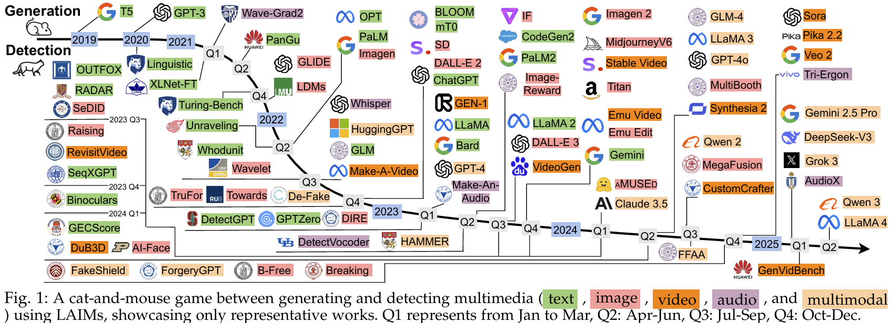
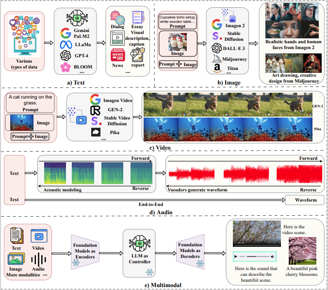
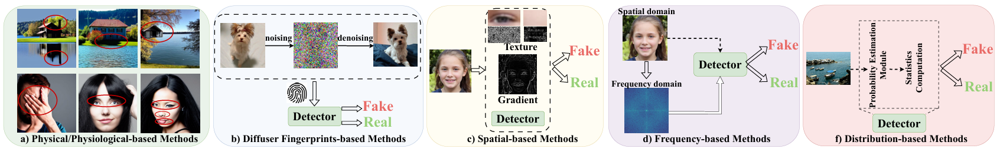
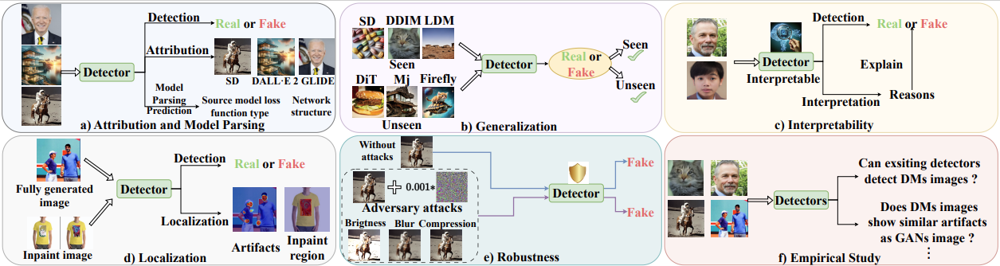

# Detect-LAIM-generated-Multimedia-Survey

This repository contains a collection of resources and papers on ***Detecting Multimedia Generated by Large AI Models: A Survey***

<figure>
  
</figure>

The references of those works are displayed in [Generation Works](https://github.com/Purdue-M2/Detect-LAIM-generated-Multimedia-Survey/blob/main/README.md#generation-works) and [Detection Works](https://github.com/Purdue-M2/Detect-LAIM-generated-Multimedia-Survey/blob/main/README.md#detection-works).

Please let us know if you find a mistake, or if we have missed your wonderful work by e-mail: lin1785@purdue.edu, hu968@purdue.edu, gupt1031@purdue.edu 

If you find our survey useful for your research, please cite the following [Paper](https://arxiv.org/abs/2402.00045)


```
@article{lin2024detecting,
  title={Detecting Multimedia Generated by Large AI Models: A Survey},
  author={Lin, Li and Gupta, Neeraj and Zhang, Yue and Ren, Hainan and Liu, Chun-Hao and Ding, Feng and Wang, Xin and Li, Xin and Verdoliva, Luisa and Hu, Shu},
  journal={arXiv preprint arXiv:2402.00045},
  year={2024}
}
```

## 💻 Contents
- [Related Works](https://github.com/Purdue-M2/Detect-LAIM-generated-Multimedia-Survey/blob/main/README.md#related-works)
- [Generation](https://github.com/Purdue-M2/Detect-LAIM-generated-Multimedia-Survey/blob/main/README.md#generation)
  - [Public Datasets for Detection](https://github.com/Purdue-M2/Detect-LAIM-generated-Multimedia-Survey/blob/main/README.md#public-datasets-for-detection)
- [Detection](https://github.com/Purdue-M2/Detect-LAIM-generated-Multimedia-Survey/blob/main/README.md)
    - [Text](https://github.com/Purdue-M2/Detect-LAIM-generated-Multimedia-Survey/blob/main/README.md#page_facing_up-text-)
        - [Pure Detection](https://github.com/Purdue-M2/Detect-LAIM-generated-Multimedia-Survey/blob/main/README.md#pure-detection)
            - [Easy Explainable Methods](https://github.com/Purdue-M2/Detect-LAIM-generated-Multimedia-Survey/blob/main/README.md#%EF%B8%8F-easy-explainable-methods)
                - [Watermarking](https://github.com/Purdue-M2/Detect-LAIM-generated-Multimedia-Survey/blob/main/README.md#%EF%B8%8F-watermarking)
                - [Non-Watermarking](https://github.com/Purdue-M2/Detect-LAIM-generated-Multimedia-Survey/blob/main/README.md#%EF%B8%8F-non-watermarking)
            - [Hard Explainable Methods](https://github.com/Purdue-M2/Detect-LAIM-generated-Multimedia-Survey/blob/main/README.md#%EF%B8%8F-hard-explainable-methods)
        - [Beyond Detection](https://github.com/Purdue-M2/Detect-LAIM-generated-Multimedia-Survey/blob/main/README.md#beyond-detection)
            - [Efficiency](https://github.com/Purdue-M2/Detect-LAIM-generated-Multimedia-Survey/blob/main/README.md#%EF%B8%8F-efficiency)
            - [Attribution](https://github.com/Purdue-M2/Detect-LAIM-generated-Multimedia-Survey/blob/main/README.md#%EF%B8%8F-attribution)
            - [Generalization](https://github.com/Purdue-M2/Detect-LAIM-generated-Multimedia-Survey/blob/main/README.md#%EF%B8%8F-generalization)
            - [Interpretability](https://github.com/Purdue-M2/Detect-LAIM-generated-Multimedia-Survey/blob/main/README.md#%EF%B8%8F-interpretability)
            - [Robustness](https://github.com/Purdue-M2/Detect-LAIM-generated-Multimedia-Survey/blob/main/README.md#%EF%B8%8F-robustness)
                - [Adversarial Attack Robustness](https://github.com/Purdue-M2/Detect-LAIM-generated-Multimedia-Survey/blob/main/README.md#%EF%B8%8F-adversarial-attack-robustness)
                - [LAIM-Polished Robustness](https://github.com/Purdue-M2/Detect-LAIM-generated-Multimedia-Survey/blob/main/README.md#%EF%B8%8F-laim-polished-robustness)
            - [Empirical Study](https://github.com/Purdue-M2/Detect-LAIM-generated-Multimedia-Survey/blob/main/README.md#%EF%B8%8F-empirical-study)
    - [Image](https://github.com/Purdue-M2/Detect-LAIM-generated-Multimedia-Survey/blob/main/README.md#--image-)
        - [Pure Detection](https://github.com/Purdue-M2/Detect-LAIM-generated-Multimedia-Survey/blob/main/README.md#pure-detection-1)
            - [Physical/Physiological based Methods](https://github.com/Purdue-M2/Detect-LAIM-generated-Multimedia-Survey/blob/main/README.md#%EF%B8%8F-physicalphysiological-based-methods)
            - [Diffuser Fingerprints based Methods](https://github.com/Purdue-M2/Detect-LAIM-generated-Multimedia-Survey/blob/main/README.md#%EF%B8%8F-diffuser-fingerprints-based-methods)
            - [Spatial-based Methods](https://github.com/Purdue-M2/Detect-LAIM-generated-Multimedia-Survey/blob/main/README.md#%EF%B8%8F-spatial-based-methods)
            - [Frequency-based Methods](https://github.com/Purdue-M2/Detect-LAIM-generated-Multimedia-Survey/blob/main/README.md#%EF%B8%8F-frequency-based-methods)
            - [Distribution-based Methods](https://github.com/Purdue-M2/Detect-LAIM-generated-Multimedia-Survey/blob/main/README.md#%EF%B8%8F-distribution-based-methods)
        - [Beyond Detection](https://github.com/Purdue-M2/Detect-LAIM-generated-Multimedia-Survey/blob/main/README.md#beyond-detection-1)
            - [Attribution and Model Parsing](https://github.com/Purdue-M2/Detect-LAIM-generated-Multimedia-Survey/blob/main/README.md#%EF%B8%8F-attribution-and-model-parsing-1)
            - [Generalization](https://github.com/Purdue-M2/Detect-LAIM-generated-Multimedia-Survey/blob/main/README.md#%EF%B8%8F-generalization-1)
            - [Interpretability](https://github.com/Purdue-M2/Detect-LAIM-generated-Multimedia-Survey/blob/main/README.md#%EF%B8%8F-interpretability-1)
            - [Localization](https://github.com/Purdue-M2/Detect-LAIM-generated-Multimedia-Survey/blob/main/README.md#%EF%B8%8F-localization)
                - [Fully-supervised](https://github.com/Purdue-M2/Detect-LAIM-generated-Multimedia-Survey/blob/main/README.md#%EF%B8%8F-fully-supervised)
                - [Weakly-supervised](https://github.com/Purdue-M2/Detect-LAIM-generated-Multimedia-Survey/blob/main/README.md#%EF%B8%8F-weakly-supervised)
            - [Robustness](https://github.com/Purdue-M2/Detect-LAIM-generated-Multimedia-Survey/blob/main/README.md#%EF%B8%8F-robustness-1)
                - [Adversarial Attack Robustness](https://github.com/Purdue-M2/Detect-LAIM-generated-Multimedia-Survey/blob/main/README.md#%EF%B8%8F-adversarial-attack-robustness)
                - [Post-Processing Robustness](https://github.com/Purdue-M2/Detect-LAIM-generated-Multimedia-Survey/blob/main/README.md#%EF%B8%8F-post-processing-robustness)
            - [Empirical Study](https://github.com/Purdue-M2/Detect-LAIM-generated-Multimedia-Survey/blob/main/README.md#%EF%B8%8F-empirical-study-1)
    - [Video](https://github.com/Purdue-M2/Detect-LAIM-generated-Multimedia-Survey/blob/main/README.md#%EF%B8%8F-video)
        - [Pure Detection](https://github.com/Purdue-M2/Detect-LAIM-generated-Multimedia-Survey/blob/main/README.md#pure-detection-2)
            - [Spatial&Temporal-based Methods](https://github.com/Purdue-M2/Detect-LAIM-generated-Multimedia-Survey/blob/main/README.md#%EF%B8%8F-spatial&-temporal-based-methods-2)
        - [Beyond Detection](https://github.com/Purdue-M2/Detect-LAIM-generated-Multimedia-Survey/blob/main/README.md#beyond-detection-2)
            - [Generalization](https://github.com/Purdue-M2/Detect-LAIM-generated-Multimedia-Survey/blob/main/README.md#%EF%B8%8F-generalization-2)
            - [Empirical Study](https://github.com/Purdue-M2/Detect-LAIM-generated-Multimedia-Survey/blob/main/README.md#%EF%B8%8F-empirical-study-2)
    - [Audio](https://github.com/Purdue-M2/Detect-LAIM-generated-Multimedia-Survey/blob/main/README.md#-audio)
        - [Pure Detection](https://github.com/Purdue-M2/Detect-LAIM-generated-Multimedia-Survey/blob/main/README.md#pure-detection-2)
            - [Vocoder-based](https://github.com/Purdue-M2/Detect-LAIM-generated-Multimedia-Survey/blob/main/README.md#%EF%B8%8F-vocoder-based)
        - [Beyond Detection](https://github.com/Purdue-M2/Detect-LAIM-generated-Multimedia-Survey/blob/main/README.md#beyond-detection-2)
            - [Generalization](https://github.com/Purdue-M2/Detect-LAIM-generated-Multimedia-Survey/blob/main/README.md#%EF%B8%8F-generalization-3)
    - [Multimodal](https://github.com/Purdue-M2/Detect-LAIM-generated-Multimedia-Survey/blob/main/README.md#-multimodal)
        - [Pure Detection](https://github.com/Purdue-M2/Detect-LAIM-generated-Multimedia-Survey/blob/main/README.md#pure-detection-3)
            - [Prompt-guided](https://github.com/Purdue-M2/Detect-LAIM-generated-Multimedia-Survey/blob/main/README.md#%EF%B8%8F-prompt-guided)
            - [Text-image Inconsistency](https://github.com/Purdue-M2/Detect-LAIM-generated-Multimedia-Survey/blob/main/README.md#%EF%B8%8F-text-image-inconsistency)
        - [Beyond Detection](https://github.com/Purdue-M2/Detect-LAIM-generated-Multimedia-Survey/blob/main/README.md#beyond-detection-3)
            - [Attribution](https://github.com/Purdue-M2/Detect-LAIM-generated-Multimedia-Survey/blob/main/README.md#%EF%B8%8F-attribution-3)
            - [Generalization](https://github.com/Purdue-M2/Detect-LAIM-generated-Multimedia-Survey/blob/main/README.md#%EF%B8%8F-generalization-4)
                - [Prompt Tuning](https://github.com/Purdue-M2/Detect-LAIM-generated-Multimedia-Survey/blob/main/README.md#%EF%B8%8F-prompt-tuning)
                - [Contrastive Learning](https://github.com/Purdue-M2/Detect-LAIM-generated-Multimedia-Survey/blob/main/README.md#%EF%B8%8F-contrastive-learning-1)
            - [Interpretability](https://github.com/Purdue-M2/Detect-LAIM-generated-Multimedia-Survey/blob/main/README.md#%EF%B8%8F-interpretability-2)
            - [Localization](https://github.com/Purdue-M2/Detect-LAIM-generated-Multimedia-Survey/blob/main/README.md#%EF%B8%8F-localization-1)
                - [Spatial-based](https://github.com/Purdue-M2/Detect-LAIM-generated-Multimedia-Survey/blob/main/README.md#%EF%B8%8F-spatial-based-1)
                - [Frequency-based](https://github.com/Purdue-M2/Detect-LAIM-generated-Multimedia-Survey/blob/main/README.md#%EF%B8%8F-frequency-based-1)
                - [MLLM-based](https://github.com/Purdue-M2/Detect-LAIM-generated-Multimedia-Survey/blob/main/README.md#%EF%B8%8F-mllm-based)
            - [Empirical Study](https://github.com/Purdue-M2/Detect-LAIM-generated-Multimedia-Survey/blob/main/README.md#%EF%B8%8F-empirical-study-2)
- [Detection Tools](https://github.com/Purdue-M2/Detect-LAIM-generated-Multimedia-Survey/blob/main/README.md#detection-tools)

## 📈 Related Work

&nbsp;&nbsp;&nbsp;&nbsp;&nbsp;&nbsp;&nbsp;&nbsp; - A Survey on Detection of LLMs-Generated Content  [Paper](https://arxiv.org/pdf/2310.15654v1.pdf) [GitHub](https://github.com/xianjun-yang/awesome_papers_on_llms_detection)

&nbsp;&nbsp;&nbsp;&nbsp;&nbsp;&nbsp;&nbsp;&nbsp; - A Survey on LLM-generated Text Detection: Necessity, Methods, and Future Directions  [Paper](https://arxiv.org/abs/2310.14724) [GitHub](https://github.com/NLP2CT/LLM-generated-Text-Detection)

&nbsp;&nbsp;&nbsp;&nbsp;&nbsp;&nbsp;&nbsp;&nbsp; - Towards possibilities \& impossibilities of ai-generated text detection: A survey  [Paper](https://arxiv.org/pdf/2310.15264.pdf)

&nbsp;&nbsp;&nbsp;&nbsp;&nbsp;&nbsp;&nbsp;&nbsp; - Machine-generated text: A comprehensive survey of threat models and detection methods [Paper](https://ieeexplore.ieee.org/stamp/stamp.jsp?tp=&arnumber=10177704)

&nbsp;&nbsp;&nbsp;&nbsp;&nbsp;&nbsp;&nbsp;&nbsp; - The Age of Synthetic Realities: Challenges and Opportunities [Paper](https://arxiv.org/abs/2306.11503)

&nbsp;&nbsp;&nbsp;&nbsp;&nbsp;&nbsp;&nbsp;&nbsp; - GenAI against humanity: Nefarious applications of generative artificial intelligence and large language models [Paper](https://arxiv.org/abs/2310.00737)


##  Generation
<figure>
  
  <figcaption>Illustrations of different types of multimedia generation process based on LAIMs.</figcaption>
</figure>

### Public Datasets for Detection

Please read the column I20(Input-to-Output) with these abbreviations:  
- T2T: Text-to-Text
- V2T: Video-to-Text
- T2I: Text-to-Image
- I2I: Image-to-Image
- T2A: Text-to-Audio
- I.A2V: (Image conditioned with Audio)-to-Video


| Modality | Dataset          | Year | BM  | Content     | Link | I2O | #Real   | #Generated | Source of Real Media                                        | Generative Method                                |
|----------|------------------|------|-----|-------------|------|-----|---------|-------------|-------------------------------------------------------------|--------------------------------------------------|
| Text     | TuringBench      | 2021 | ✔   | News        | [Link](https://turingbench.ist.psu.edu/) | T2T | 8,854   | 159,758     | News Media                                                 | GPT-1&2&3, CTRL, GROVER                |
|          | Paraphrase       | 2022 |     | Essays      | [Link](https://huggingface.co/datasets/jpwahle/autoregressive-paraphrase-dataset) | T2T | 98,280  | 163,710     | Arxiv, Wikipedia, Theses                                   | GPT-3, T5                                   |
|          | SynSCiPass   | 2022 |     | Passages    | [Link](https://github.com/domenicrosati/synscipass/tree/main/data) | T2T | 99,989  | 99,989      | Scientific papers                                          | GPT-2, BLOOM                                |
|          | MAGE         | 2023 | ✔   | General     | [Link](https://github.com/yafuly/MAGE) | T2T | 154,078 | 294,381     | Reddit, EL15, Yelp, XSum                         | 27 LLMs                                          |
|          | Stu.Essays   | 2023 |     | Essays      | [Link](https://github.com/vivek3141/ghostbuster) | T2T | 1,000   | 6,000       | Ivy Panda                                             | ChatGPT                                          |
|          | Writing      | 2023 |     | Stories     | [Link](https://github.com/vivek3141/ghostbuster) | T2T | 1,000   | 6,000       | Reddit WritingPrompts                               | ChatGPT                                          |
|          | News         | 2023 |     | News        | [Link](https://github.com/vivek3141/ghostbuster) | T2T | 1,000   | 6,000       | Reuters 50-50                                         | ChatGPT                                          |
|          | OUTFOX      | 2023 | ✔   | News        | [Link](https://github.com/ryuryukke/OUTFOX) | T2T | 15,400  | 15,400      | Feedback Prize                                        | ChatGPT, GPT-3.5, T5                        |
|          | MULTITuDE   | 2023 | ✔   | Essays      | [Link](https://zenodo.org/records/10013755) | T2T | 7,992   | 16,005      | MassiveSumm                                           | GPT-3&4, ChatGPT                                 |
|          | MGTDetect-CoCo | 2023 |     | News        | [Link](https://huggingface.co/datasets/ZachW/MGTDetect_CoCo) | T2T | 10,486  | 10,484      | News Outlets                                               | GPT-3.5                                          |
|          | HPPT        | 2023 |     | Abstracts   | [Link](https://github.com/FreedomIntelligence/ChatGPT-Detection-PR-HPPT) | T2T | 1,000   | 1,000       | ACL Anthology                                          | ChatGPT                                          |
|          | HC-Var       | 2023 |     | General     | [Link](https://huggingface.co/datasets/hannxu/hc_var) | T2T | 90,096  | 90,096      | XSum , IMDb, Yelp, FiQA                           | ChatGPT                                          |
|          | HC3         | 2023 | ✔   | General     | [Link](http://huggingface.co/datasets/Hello-SimpleAI/HC3) | T2T | 26,903  | 58,546      | FiQA , EL15 , MediaDialog                     | ChatGPT                                          |
|          | M4           | 2023 | ✔   | General     | [Link](https://github.com/mbzuai-nlp/M4) | T2T | 32,799  | 58,803      | WikiHow , Arxiv, Reddit                                | ChatGPT, GPT-3.5, LLaMA, T5, BLOOM     |
|          | F3         | 2023 |     | Social Media| [Link](https://github.com/mickeymst/F3/tree/main) | T2T | 12,723  | 27,667      | Politifact , Snopes                                | GPT-3.5                                          |
|          | MixSet       | 2024 |     | General     | [Link](https://github.com/Dongping-Chen/MixSet) | T2T | 3,600   | 3,600       | Email , BBC News, ArXiv                           | GPT-4, LLaMA2                                    |
|          | GPABench     | 2024 | ✔   | Writing     | [Link](https://github.com/liuzey/CheckGPT-v2) | T2T | 150,000 | 450,000     | Arxiv                                                     | GPT-3.5                                          |
|          | M4GT-Bench       | 2024 |     | General     | [Link](https://github.com/mbzuai-nlp/M4GT-Bench) | T2T | 119,771 | 119,388     | Wikipedia, WikiHow, Reddit, ArXiv, News                   | 10 LLMs                                          |
|          | RAID        | 2024 | ✔   | General     | [Link](https://github.com/liamdugan/raid) | T2T | 14,917  | 6,287,820   | Public datasets from 8 domains                            | 11 LLMs                                          |
|          | DetectRL     | 2024 |     | General     | [Link](https://github.com/NLP2CT/DetectRL) | T2T | 100,800 | 134,400     | Writing Prompts , Yelp                                | GPT-3.5, PaLM2, Claude, LLaMA2              |
|          | MultiSocial  | 2024 |     | Social Media| -         | T2T | 58,000  | 414,000     | Gab, Discord, WhatsApp                                    | 7 LLMs                                           |
|          | SM-D         | 2024 |     | Social Media| -         | T2T | -       | -           | Medium, Quora, Reddit                                     | Sourced from social media                        |
| Image    | DFF          | 2023 |     | Face        | [Link](https://huggingface.co/datasets/OpenRL/DeepFakeFace) | T/I2I | 30,000    | 90,000       | IMDB-WIKI                                    | SDMs, InsightFace                                   |
|          | RealFaces   | 2023 |     | Face        | [Link](https://github.com/LucaCorvitto/RealFaces_w_StableDiffusion) | T2I   | 258       | 258          | Prompts                                           | SDMs                                                      |
|          | OHImg        | 2023 |     | Overhead    | [Link](https://stresearch.github.io/synthetic-overhead-dataset/) | T/I2I | 6,475     | 6,675        | MapBox , Google Maps                          | GLIDE, DDPM                                     |
|          | Western Blot | 2022 |     | Biology     | [Link](https://www.dropbox.com/scl/fo/marrklyrjrs7aaeggtfe8/AL3GBGKy5fu6odgC9p7GIiQ?rlkey=v4g6whl90cg3ldvi7dic6dm82&e=1&dl=0) | T/I2I | ~14,000   | -            | Western Blot                                      | DDPM, Pix2pix, CycleGAN                         |
|          | Synthbuster | 2023 |     | General     | [Link](https://zenodo.org/records/10066460) | T2I   | -         | 9,000        | Raise-1K                                          | DALL-E 2&3, Midjourney, SDMs, GLIDE                 |
|          | GenImage    | 2023 | ✔   | General     | [Link](https://github.com/GenImage-Dataset/GenImage) | T/I2I | 1,331,167 | 1,350,000     | ImageNet                                          | SDMs, Midjourney, BigGAN                            |
|          | CIFAKE       | 2023 |     | General     | [Link](https://www.kaggle.com/datasets/birdy654/cifake-real-and-ai-generated-synthetic-images) | T/I2I | 60,000    | 60,000       | CIFAR-10                                          | SD-V1.4                                                   |
|          | AutoSplice   | 2023 |     | General     | [Link](https://github.com/shanface33/AutoSplice_Dataset) | T2I   | 2,275     | 3,621        | Visual News                                       | DALL-E 2                                                  |
|          | DiffusionDB  | 2023 |     | General     | [Link](https://huggingface.co/datasets/poloclub/diffusiondb) | T/I2I | 3,300,000 | 16,000,000   | DiscordChatExporter                           | SD                                                        |
|          | Artifact    | 2023 |     | General     | [Link](https://www.kaggle.com/datasets/awsaf49/artifact-dataset/) | T/I2I | 1,749     | 960,894      | COCO, FFHQ , COCO, LSUN                       | SDMs, DDPM, LDM, CIPS                      |
|          | HiFi-FIDL    | 2023 | ✔   | General     | [Link](https://github.com/CHELSEA234/HiFi_IFDL) | T/I2I | ~60,000   | 1,300,000     | FFHQ , COCO, LSUN                              | DDPM, GLIDE, LDM, GANs                     |
|          | DiffForensics | 2023 |     | General     | [Link](https://github.com/ZhendongWang6/DIRE) | T/I2I | 232,000   | 232,000      | LSUN, ImageNet                                     | LDM, DDPM, VQDM, ADM                 |
|          | CocoGlide   | 2023 |     | General     | [Link](https://github.com/grip-unina/TruFor) | T/I2I | 512       | 512          | COCO                                               | GLIDE                                                |
|          | LSUNDB       | 2023 |     | General     | [Link](https://zenodo.org/records/7528113) | T/I2I | 250,000   | 250,000      | LSUN                                               | DDPM, LDM, StyleGAN                        |
|          | UniFake      | 2023 |     | General     | [Link](https://drive.google.com/file/d/1FXlGIRh_Ud3cScMgSVDbEWmPDmjcrm1t/view) | T/I2I | 8,000     | 8,000        | LAION-400M                                     | LDM, GLIDE                                     |
|          | REGM        | 2023 |     | General     | [Link](https://drive.google.com/file/d/1bAmC_9aMkWJB_scGvOOWvNeLa9FBoMUr/view) | T/I2I | 116,000   | 116,000      | CelebA , LSUN                                  | 116 publicly available GMs                                |
|          | DMImage     | 2023 |     | General     | [Link](https://github.com/grip-unina/DMimageDetection) | T/I2I | 200,000   | 200,000      | COCO, LSUN                                          | LDM                                                 |
|          | AIGCD       | 2023 | ✔   | General     | [Link](https://github.com/Ekko-zn/AIGCDetectBenchmark) | T/I2I | 360,000   | 580,000      | LSUN, COCO, FFHQ                             | SDMs, GANs, ADM, DALL-E 2, GLIDE               |
|          | DIF        | 2023 | ✔   | General     | [Link](https://github.com/sergo2020/dif_pytorch_official) | T/I2I | 34,800    | 54,500       | LAION-585                                           | SDMs, DALL-E 2, GLIDE, GANS                          |
|          | Fake2M      | 2024 | ✔   | General     | [Link](https://github.com/Inf-imagine/Sentry) | T/I2I | 2,300,000 | -            | CC3M                                           | SD-V1.5, IOI, IF , StyleGAN3                  |
|          | SID-Set     | 2024 |     | Social Media| [Link](https://github.com/hzlsaber/SIDA) | T/I2I | 100,000   | 100,000      | COCO, Flickr30K, MagicBrush                          | FLUX                                                |
|          | Chameleon   | 2024 |     | Social Media| [Link](https://github.com/shilinyan99/AIDE) | T/I2I | 14,863    | 11,170       | Unsplash                                       | GANs, SDMs, DALL-E 2, GLIDE                         |
|          | DF40       | 2024 |     | Face        | [Link](https://github.com/YZY-stack/DF40) | T/I2I | ~1,100    | ~1,000,000   | FF++, CDF, FFHQ, CelebA                              | SDMs, GANs, Midjourney, DDPM                             |
|          | FakeBench  | 2024 |     | General     | [Link](https://github.com/Yixuan423/FakeBench) | T/I2I | 3,000     | 3,000        | 10 Public Datasets                                   | 10 Generative Models                                     |
|          | AI-Face     | 2024 | ✔   | Face        | [Link](https://github.com/Purdue-M2/AI-Face-FairnessBench) | T/I2I | 400,885   | 1,245,660    | 6 Public datasets                                     | SDMs, GANs, Midjourney, IF                               |
| Video    | WildDeepfake | 2021 |     | Face        | [Link](https://github.com/OpenTAI/wild-deepfake) | I.A2V   | 3,805       | 3,509         | Social Media                                           | Social Media                                   |
|          | DiffHead     | 2023 |     | Face        | [Link](https://drive.google.com/file/d/1zWSqtV7O4WGkgh6WB55b8Mdg2lXXUudH/view) | I.A2V   | 820         | -             | CREMA                                             | Diffused Heads: build on DDPM                  |
|          | DVF         | 2024 |     | General     | [Link](https://github.com/SparkleXFantasy/MM-Det) | I/T2V   | 2,750       | 3,938         | Intervid , Youtube-8M                      | 8 Diffusion Models                             |
|          | GenVideo     | 2024 | ✔   | General     | [Link](https://github.com/chenhaoxing/DeMamba) | I/T2V   | 1,223,511   | 1,078,838     | Kinetics-400 , Youku-mPLUG, MSR-VTT  | 20 Generative Models                           |
|          | GenVidBench  | 2025 | ✔   | General     | [Link](https://genvidbench.github.io/) | I/T2V   | 33,931      | 110,400       | Vript , HDL-VG-130M                        | 8 Generative Models                            |
|          | PDID        | 2024 |     | Social Media| [Link](https://airtable.com/appOU03dlKuBdbmty/shrEkrIYINbrcKQ3z/tbleGYjNLn2D4Xfzs) | -       | -           | -             | Social Media                                           | Social Media                                   |
| Audio    | In-the-Wild  | 2022 |     | Speech      | [Link](https://deepfake-total.com/in_the_wild) | T2A     | 20.7 hours  | 17.2 hours    | Social Media, Video Streaming Platforms               | Social Media, Video Streaming Platforms        |
|          | LibriSeVoc  | 2023 |     | Speech      | [Link](https://github.com/csun22/Synthetic-Voice-Detection-Vocoder-Artifacts) | T2A     | 13,201      | 79,206        | LibriTTS                                         | DiffWave, WaveNet                 |
|          | SONAR       | 2024 |     | Speech      | [Link](https://github.com/Jessegator/SONAR) | T2A     | -           | 2,274         | LibriTTS                                         | OpenAI, Seed-TTS, AudioGen  |
|          | ASVspoof 2024 | 2024| ✔   | Speech      | [Link](https://www.asvspoof.org/workshop2024) | T/A2A   | ~289,527    | ~1,211,186    | MLS-English                                      | 32 Manipulation Methods                        |
| Multi-modal  | *DGM^4*         | 2023 |     | News        | [Link](https://github.com/rshaojimmy/MultiModal-DeepFake) | T/I2T                    | 77,426    | 152,574       | Visual News                                                | B-GST, StyleCLIP, HFGI         |
|              | COCOFake       | 2023 |     | General     | [Link](https://github.com/aimagelab/COCOFake) | T/I2T                    | 113,287   | 566,435       | COCO                                                           | SDMs                                             |
|              | AV-Deepfake1M  | 2023 | ✔   | Face        | [Link](https://github.com/ControlNet/AV-Deepfake1M) | T2A                     | 286,721   | 860,039       | Voxceleb2                                               | VITS, YourTTS, TalkLip        |
|              | *D³*          | 2024 |     | General     | [Link](https://github.com/aimagelab/CoDE) | T2I                     | ~2,300,000| ~9,200,000     | LAION-400M                                                     | SDMs, IF                                         |
|              | *M³A*          | 2024 |     | News        | -    | T2T/I/T/V/V/A/T<br>T/I/V/V/A2T | 708,425   | 6,566,386     | 60 News Outlets                                                | LLaMA2, GPT-4, GLIDE, SD, Tango       |
|              | LOKI        | 2024 |     | General     | [Link](https://opendatalab.github.io/LOKI/) | T2T/I/T/V/V/T<br>T/I/V/V/A2T | ~9,000    | ~9,000         | 21 Public Datasets                                             | 43 Generative Models                             |
|              | MMFakeBench    | 2024 | ✔   | Social Media| [Link](https://liuxuannan.github.io/MMFakeBench.github.io/) | T2T/I                  | -         | ~11,000        | MS-COCO, VisualNews, Reddit, FEVER                       | GPT-3.5, SD-XL, DALL-E 3, Midjourney             |
|              | Deepfake-Eval| 2024 |     | Social Media| [Link](https://github.com/nuriachandra/Deepfake-Eval-2024) | T2T/A/V                | 3,390     | 2,441          | Social Media                                                  | Social Media                                     |
|              | ILLUSION       | 2025 | ✔   | General     | [Link](https://www.iab-rubric.org/illusion-database) | T2A/I<br>I2I            | 139,740   | 1,232,246      | CelebV-Text [158], COCO, MusicCaps , Social Media        | 28 Generative Methods                            |

## :mag_right: Detection :fire:

### <p align="center">:page_facing_up: Text </p>
-----------
### Pure Detection

<figure>
  
  <figcaption style="text-align: center;">Illustrations of pure detection methodologies for LAIM-generated text.</figcaption>
</figure>

#### &nbsp;&nbsp;♣️ Easy Explainable Methods
##### &nbsp;&nbsp;&nbsp;&nbsp;&nbsp;&nbsp;&nbsp;&nbsp;▶️ Watermarking

&nbsp;&nbsp;&nbsp;&nbsp;&nbsp;&nbsp;&nbsp;&nbsp; - Distillation-Resistant Watermarking for Model Protection in NLP  [Paper](https://aclanthology.org/2022.findings-emnlp.370.pdf)

&nbsp;&nbsp;&nbsp;&nbsp;&nbsp;&nbsp;&nbsp;&nbsp; - Three bricks to consolidate watermarks for large language models  [Paper](https://arxiv.org/abs/2308.00113) [GitHub](https://github.com/facebookresearch/three_bricks)

&nbsp;&nbsp;&nbsp;&nbsp;&nbsp;&nbsp;&nbsp;&nbsp; - Robust multi-bit natural language watermarking through invariant features  [Paper](https://aclanthology.org/2023.acl-long.117.pdf)

&nbsp;&nbsp;&nbsp;&nbsp;&nbsp;&nbsp;&nbsp;&nbsp; - Undetectable Watermarks for Language Models  [Paper](https://arxiv.org/pdf/2306.09194.pdf)

&nbsp;&nbsp;&nbsp;&nbsp;&nbsp;&nbsp;&nbsp;&nbsp; - Robust distortion-free watermarks for language models  [Paper](https://arxiv.org/abs/2307.15593)

&nbsp;&nbsp;&nbsp;&nbsp;&nbsp;&nbsp;&nbsp;&nbsp; - Provable robust watermarking for ai-generated text  [Paper](https://arxiv.org/abs/2306.17439) [GitHub](https://github.com/XuandongZhao/Unigram-Watermark)

&nbsp;&nbsp;&nbsp;&nbsp;&nbsp;&nbsp;&nbsp;&nbsp; - A Private Watermark for Large Language Models  [Paper](https://arxiv.org/abs/2307.16230v2)
    
    
##### &nbsp;&nbsp;&nbsp;&nbsp;&nbsp;&nbsp;&nbsp;&nbsp;▶️ Non-watermarking
    
&nbsp;&nbsp;&nbsp;&nbsp;&nbsp;&nbsp;&nbsp;&nbsp; - Unraveling the mystery of artifacts in machine generated text  [Paper](https://aclanthology.org/2022.lrec-1.744.pdf)
    
&nbsp;&nbsp;&nbsp;&nbsp;&nbsp;&nbsp;&nbsp;&nbsp; - Stylometric detection of ai-generated text in twitter timelines  [Paper](https://arxiv.org/abs/2303.03697)

&nbsp;&nbsp;&nbsp;&nbsp;&nbsp;&nbsp;&nbsp;&nbsp; - CoCo: Coherence-Enhanced Machine-Generated Text Detection Under Data Limitation With Contrastive Learning [Paper](https://aclanthology.org/2023.emnlp-main.1005/)

&nbsp;&nbsp;&nbsp;&nbsp;&nbsp;&nbsp;&nbsp;&nbsp; - Beat LLMs at Their Own Game: Zero-Shot LLM-Generated Text Detection via Querying ChatGPT [Paper](https://aclanthology.org/2023.emnlp-main.463/) [GitHub](https://github.com/thunlp/LLM-generated-text-detection)

&nbsp;&nbsp;&nbsp;&nbsp;&nbsp;&nbsp;&nbsp;&nbsp; - Who Wrote This? The Key to Zero-Shot LLM-Generated Text Detection Is GECScore [Paper](https://arxiv.org/abs/2405.04286) [GitHub](https://github.com/NLP2CT/GECScore)


#### &nbsp;&nbsp;♣️ Hard Explainable Methods

&nbsp;&nbsp;&nbsp;&nbsp;&nbsp;&nbsp;&nbsp;&nbsp; - HowkGPT: Investigating the Detection of ChatGPT-generated University Student Homework through Context-Aware Perplexity Analysis  [Paper](https://arxiv.org/abs/2305.18226)

&nbsp;&nbsp;&nbsp;&nbsp;&nbsp;&nbsp;&nbsp;&nbsp; - GPTZero [Tool](https://gptzero.me/)

&nbsp;&nbsp;&nbsp;&nbsp;&nbsp;&nbsp;&nbsp;&nbsp; - Detectgpt: Zero-shot machine-generated text detection using probability curvature [Paper](https://dl.acm.org/doi/10.5555/3618408.3619446) [GitHub](https://github.com/eric-mitchell/detect-gpt)

&nbsp;&nbsp;&nbsp;&nbsp;&nbsp;&nbsp;&nbsp;&nbsp; - Spotting LLMs With Binoculars: Zero-Shot Detection of Machine-Generated Text [Paper](https://arxiv.org/abs/2401.12070) [GitHub](https://github.com/ahans30/Binoculars)

&nbsp;&nbsp;&nbsp;&nbsp;&nbsp;&nbsp;&nbsp;&nbsp; - Multiscale Positive-Unlabeled Detection of AI-Generated Texts [Paper](https://arxiv.org/abs/2305.18149) [GitHub](https://github.com/YuchuanTian/AIGC_text_detector)

### Beyond Detection

<figure>
  
  <figcaption style="text-align: center;">Illustrations of beyond detection methodologies for LAIM-generated text. </figcaption>
</figure>

#### &nbsp;&nbsp;♣️ Efficiency

&nbsp;&nbsp;&nbsp;&nbsp;&nbsp;&nbsp;&nbsp;&nbsp; - Efficient Detection of LLM-generated Texts with a Bayesian Surrogate Model [Paper](https://aclanthology.org/2024.findings-acl.366/)

&nbsp;&nbsp;&nbsp;&nbsp;&nbsp;&nbsp;&nbsp;&nbsp; - Fast-DetectGPT: Efficient Zero-Shot Detection of Machine-Generated Text via Conditional Probability Curvature [Paper](https://arxiv.org/abs/2310.05130) [GitHub](https://github.com/baoguangsheng/fast-detect-gpt)

&nbsp;&nbsp;&nbsp;&nbsp;&nbsp;&nbsp;&nbsp;&nbsp; - DetectLLM: Leveraging Log Rank Information for Zero-Shot Detection of Machine-Generated Text [Paper](https://arxiv.org/abs/2306.05540) [GitHub](https://github.com/mbzuai-nlp/DetectLLM)

&nbsp;&nbsp;&nbsp;&nbsp;&nbsp;&nbsp;&nbsp;&nbsp; - SeqXGPT: Sentence-Level AI-Generated Text Detection [Paper](https://arxiv.org/abs/2310.08903) [GitHub](https://github.com/Jihuai-wpy/SeqXGPT)

&nbsp;&nbsp;&nbsp;&nbsp;&nbsp;&nbsp;&nbsp;&nbsp; - Glimpse: Enabling White-Box Methods to Use Proprietary Models for Zero-Shot LLM-Generated Text Detection [Paper](https://arxiv.org/abs/2412.11506) [GitHub](https://github.com/baoguangsheng/glimpse)


#### &nbsp;&nbsp;♣️ Attribution

&nbsp;&nbsp;&nbsp;&nbsp;&nbsp;&nbsp;&nbsp;&nbsp; - TURINGBENCH: A Benchmark Environment for Turing Test in the Age of Neural Text Generation [Paper](https://aclanthology.org/2021.findings-emnlp.172.pdf) [Turingbench](https://turingbench.ist.psu.edu/)

&nbsp;&nbsp;&nbsp;&nbsp;&nbsp;&nbsp;&nbsp;&nbsp; - Whodunit? Learning to Contrast for Authorship Attribution [Paper](https://aclanthology.org/2022.aacl-main.84.pdf)

&nbsp;&nbsp;&nbsp;&nbsp;&nbsp;&nbsp;&nbsp;&nbsp; - Through the looking glass: Learning to attribute synthetic text generated by language models [Paper](https://aclanthology.org/2021.eacl-main.155.pdf)

&nbsp;&nbsp;&nbsp;&nbsp;&nbsp;&nbsp;&nbsp;&nbsp; - TopRoBERTa: Topology-Aware Authorship Attribution of Deepfake Texts [Paper](https://arxiv.org/pdf/2309.12934.pdf)

&nbsp;&nbsp;&nbsp;&nbsp;&nbsp;&nbsp;&nbsp;&nbsp; - Authorship attribution for neural text generation [Paper](https://aclanthology.org/2020.emnlp-main.673.pdf) [GitHub](https://github.com/AdaUchendu/Authorship-Attribution-for-Neural-Text-Generation)

&nbsp;&nbsp;&nbsp;&nbsp;&nbsp;&nbsp;&nbsp;&nbsp; - Gpt-who: An information density-based machine-generated text detector [Paper](https://arxiv.org/pdf/2310.06202.pdf)

&nbsp;&nbsp;&nbsp;&nbsp;&nbsp;&nbsp;&nbsp;&nbsp; - LLMDet: A Third Party Large Language Models Generated Text Detection Tool [Paper](https://aclanthology.org/2023.findings-emnlp.139.pdf) [GitHub](https://github.com/TrustedLLM/LLMDet)

&nbsp;&nbsp;&nbsp;&nbsp;&nbsp;&nbsp;&nbsp;&nbsp; - Few-Shot Detection of Machine-Generated Text using Style Representations [Paper](https://arxiv.org/abs/2401.06712)

&nbsp;&nbsp;&nbsp;&nbsp;&nbsp;&nbsp;&nbsp;&nbsp; - Origin Tracing and Detecting of LLMs [Paper](https://arxiv.org/abs/2304.14072)


#### &nbsp;&nbsp;♣️ Generalization

&nbsp;&nbsp;&nbsp;&nbsp;&nbsp;&nbsp;&nbsp;&nbsp; - Ghostbuster: Detecting Text Ghostwritten by Large Language Models [Paper](https://arxiv.org/abs/2305.15047)

&nbsp;&nbsp;&nbsp;&nbsp;&nbsp;&nbsp;&nbsp;&nbsp; - Conda: Contrastive domain adaptation for ai-generated text detection [Paper](https://arxiv.org/abs/2309.03992) [GitHub](https://github.com/AmritaBh/ConDA-gen-text-detection)

&nbsp;&nbsp;&nbsp;&nbsp;&nbsp;&nbsp;&nbsp;&nbsp; - Text Fluoroscopy: Detecting LLM-Generated Text through Intrinsic Features [Paper](https://aclanthology.org/2024.emnlp-main.885/) [GitHub](https://github.com/Fish-and-Sheep/Text-Fluoroscopy)

&nbsp;&nbsp;&nbsp;&nbsp;&nbsp;&nbsp;&nbsp;&nbsp; - DeTeCtive: Detecting AI-generated Text via Multi-Level Contrastive Learning [Paper](https://arxiv.org/abs/2410.20964) [GitHub](https://github.com/heyongxin233/DeTeCtive)

&nbsp;&nbsp;&nbsp;&nbsp;&nbsp;&nbsp;&nbsp;&nbsp; - Intrinsic Dimension Estimation for Robust Detection of AI-Generated Texts [Paper](https://arxiv.org/abs/2306.04723) [GitHub](https://github.com/ArGintum/GPTID)

#### &nbsp;&nbsp;♣️ Interpretability

&nbsp;&nbsp;&nbsp;&nbsp;&nbsp;&nbsp;&nbsp;&nbsp; - DNA-GPT: Divergent N-Gram Analysis for Training-Free Detection of GPT-Generated Text [Paper](https://arxiv.org/abs/2305.17359) [GitHub](https://github.com/Xianjun-Yang/DNA-GPT)

&nbsp;&nbsp;&nbsp;&nbsp;&nbsp;&nbsp;&nbsp;&nbsp; - A Watermark for Large Language Models [Paper](https://proceedings.mlr.press/v202/kirchenbauer23a/kirchenbauer23a.pdf) [GitHub](https://github.com/jwkirchenbauer/lm-watermarking)

&nbsp;&nbsp;&nbsp;&nbsp;&nbsp;&nbsp;&nbsp;&nbsp; - Chatgpt or human? detect and explain. explaining decisions of machine learning model for detecting short chatgpt-generated text [Paper](https://arxiv.org/abs/2301.13852)

&nbsp;&nbsp;&nbsp;&nbsp;&nbsp;&nbsp;&nbsp;&nbsp; - Check Me If You Can: Detecting ChatGPT-Generated Academic Writing using CheckGPT [Paper](https://arxiv.org/abs/2306.05524)

&nbsp;&nbsp;&nbsp;&nbsp;&nbsp;&nbsp;&nbsp;&nbsp; - Is chatgpt involved in texts? measure the polish ratio to detect chatgpt-generated text [Paper](https://arxiv.org/pdf/2307.11380.pdf#:~:text=PR%3A%20Polish%20Ratio%20is%20a,and%20the%20corresponding%20polished%20texts.)


#### &nbsp;&nbsp;♣️ Robustness
##### &nbsp;&nbsp;&nbsp;&nbsp;&nbsp;&nbsp;&nbsp;&nbsp;▶️ Adversarial Attack Robustness

&nbsp;&nbsp;&nbsp;&nbsp;&nbsp;&nbsp;&nbsp;&nbsp; - Red Teaming Language Model Detectors with Language Models [Paper](https://arxiv.org/abs/2305.19713)

&nbsp;&nbsp;&nbsp;&nbsp;&nbsp;&nbsp;&nbsp;&nbsp; - Radar: Robust ai-text detection via adversarial learning [Paper](https://arxiv.org/abs/2307.03838) [Project Page](https://radar.vizhub.ai/)

&nbsp;&nbsp;&nbsp;&nbsp;&nbsp;&nbsp;&nbsp;&nbsp; - J-guard: Journalism guided adversarially robust detection of ai-generated news [Paper](http://www.afnlp.org/conferences/ijcnlp2023/proceedings/main-long/cdrom/pdf/2023.ijcnlp-long.32.pdf4)

&nbsp;&nbsp;&nbsp;&nbsp;&nbsp;&nbsp;&nbsp;&nbsp; - Outfox: Llm-generated essay detection through in-context learning with adversarially generated examples [Paper](https://arxiv.org/abs/2307.11729)

##### &nbsp;&nbsp;&nbsp;&nbsp;&nbsp;&nbsp;&nbsp;&nbsp;▶️ LAIM-Polished Robustness

&nbsp;&nbsp;&nbsp;&nbsp;&nbsp;&nbsp;&nbsp;&nbsp; - Is chatgpt involved in texts? measure the polish ratio to detect chatgpt-generated text [Paper](https://arxiv.org/pdf/2307.11380.pdf#:~:text=PR%3A%20Polish%20Ratio%20is%20a,and%20the%20corresponding%20polished%20texts.)


#### &nbsp;&nbsp;♣️ Empirical Study

&nbsp;&nbsp;&nbsp;&nbsp;&nbsp;&nbsp;&nbsp;&nbsp; - ChatLog: Recording and Analyzing ChatGPT Across Time [Paper](https://arxiv.org/abs/2304.14106) [GitHub](https://github.com/THU-KEG/ChatLog)

&nbsp;&nbsp;&nbsp;&nbsp;&nbsp;&nbsp;&nbsp;&nbsp; - On the Zero-Shot Generalization of Machine-Generated Text Detectors [Paper](https://arxiv.org/abs/2310.05165)

&nbsp;&nbsp;&nbsp;&nbsp;&nbsp;&nbsp;&nbsp;&nbsp; - On the Generalization of Training-based ChatGPT Detection Methods [Paper](https://arxiv.org/pdf/2310.01307.pdf)

&nbsp;&nbsp;&nbsp;&nbsp;&nbsp;&nbsp;&nbsp;&nbsp; - Supervised Machine-Generated Text Detectors: Family and Scale Matters [Paper](https://link.springer.com/chapter/10.1007/978-3-031-42448-9_11) [GitHub](https://github.com/symanto-research/supervised-mgt-family-scale)

&nbsp;&nbsp;&nbsp;&nbsp;&nbsp;&nbsp;&nbsp;&nbsp; - Deepfake Text Detection in the Wild [Paper](https://arxiv.org/abs/2305.13242) [GitHub](https://github.com/yafuly/DeepfakeTextDetect)

&nbsp;&nbsp;&nbsp;&nbsp;&nbsp;&nbsp;&nbsp;&nbsp; - How large language models are transforming machine-paraphrased plagiarism  [Paper](https://aclanthology.org/2022.emnlp-main.62.pdf)

&nbsp;&nbsp;&nbsp;&nbsp;&nbsp;&nbsp;&nbsp;&nbsp; - Paraphrase Detection: Human vs. Machine Content [Paper](https://arxiv.org/abs/2303.13989)

&nbsp;&nbsp;&nbsp;&nbsp;&nbsp;&nbsp;&nbsp;&nbsp; - MGTBench: Benchmarking Machine-Generated Text Detection [Paper](https://dl.acm.org/doi/10.1145/3658644.3670344) [GitHub](https://github.com/xinleihe/MGTBench)

&nbsp;&nbsp;&nbsp;&nbsp;&nbsp;&nbsp;&nbsp;&nbsp; - How close is chatgpt to human experts? comparison corpus, evaluation, and detection [Paper](https://arxiv.org/abs/2301.07597) [GitHub](https://github.com/Hello-SimpleAI/chatgpt-comparison-detection)

&nbsp;&nbsp;&nbsp;&nbsp;&nbsp;&nbsp;&nbsp;&nbsp; - Can LLM-Generated Misinformation Be Detected? [Paper](https://arxiv.org/abs/2309.13788) [GitHub](https://llm-misinformation.github.io/)

&nbsp;&nbsp;&nbsp;&nbsp;&nbsp;&nbsp;&nbsp;&nbsp; - From Text to Source: Results in Detecting Large Language Model-Generated Content [Paper](https://arxiv.org/abs/2309.13322)

### <p align="center"> 📸 Image </p>
-----------
###  Pure Detection

<figure>
  
  <figcaption style="text-align: center;">Illustrations of pure detection methodologies for LAIM-generated image.</figcaption>
</figure>

#### &nbsp;&nbsp;♣️ Physical/Physiological based Methods

&nbsp;&nbsp;&nbsp;&nbsp;&nbsp;&nbsp;&nbsp;&nbsp; - Qualitative Failures of Image Generation Models and Their Application in Detecting Deepfakes [Paper](https://arxiv.org/abs/2304.06470)

&nbsp;&nbsp;&nbsp;&nbsp;&nbsp;&nbsp;&nbsp;&nbsp; - Perspective (in) consistency of paint by text [Paper](https://arxiv.org/abs/2206.14617)

&nbsp;&nbsp;&nbsp;&nbsp;&nbsp;&nbsp;&nbsp;&nbsp; - Lighting (in) consistency of paint by text [Paper](https://arxiv.org/abs/2207.13744)


#### &nbsp;&nbsp;♣️ Diffuser Fingerprints based Methods

&nbsp;&nbsp;&nbsp;&nbsp;&nbsp;&nbsp;&nbsp;&nbsp; - Deep Image Fingerprint: Accurate And Low Budget Synthetic Image Detector [Paper](https://openaccess.thecvf.com/content/WACV2024/supplemental/Sinitsa_Deep_Image_Fingerprint_WACV_2024_supplemental.pdf)

&nbsp;&nbsp;&nbsp;&nbsp;&nbsp;&nbsp;&nbsp;&nbsp; - DIRE for Diffusion-Generated Image Detection [Paper](https://openaccess.thecvf.com/content/ICCV2023/papers/Wang_DIRE_for_Diffusion-Generated_Image_Detection_ICCV_2023_paper.pdf) [GitHub](https://github.com/ZhendongWang6/DIRE)

&nbsp;&nbsp;&nbsp;&nbsp;&nbsp;&nbsp;&nbsp;&nbsp; - Exposing the Fake: Effective Diffusion-Generated Images Detection [Paper](https://openreview.net/forum?id=7R62e4Wgim&referrer=%5Bthe%20profile%20of%20Fei%20Kong%5D(%2Fprofile%3Fid%3D~Fei_Kong1))

&nbsp;&nbsp;&nbsp;&nbsp;&nbsp;&nbsp;&nbsp;&nbsp; - LaRE^2: Latent Reconstruction Error Based Method for Diffusion-Generated Image Detection [Paper](https://arxiv.org/abs/2403.17465) [GitHub](https://github.com/luo3300612/LaRE)

&nbsp;&nbsp;&nbsp;&nbsp;&nbsp;&nbsp;&nbsp;&nbsp; - Aligned Datasets Improve Detection of Latent Diffusion-Generated Images [Paper](https://arxiv.org/abs/2410.11835) [GitHub](https://github.com/AniSundar18/AlignedForensics)

&nbsp;&nbsp;&nbsp;&nbsp;&nbsp;&nbsp;&nbsp;&nbsp; - Manifold Induced Biases for Zero-shot and Few-shot Detection of Generated Images [Paper](https://arxiv.org/abs/2504.15470) [GitHub](https://github.com/JonathanBrok/Manifold-Induced-Biases-for-Zero-shot-and-Few-shot-Detection-of-Generated-Images)

#### &nbsp;&nbsp;♣️ Spatial-based Methods

&nbsp;&nbsp;&nbsp;&nbsp;&nbsp;&nbsp;&nbsp;&nbsp; - Rich and Poor Texture Contrast: A Simple yet Effective Approach for AI-generated Image Detection [Paper](https://arxiv.org/abs/2311.12397) [Project Page](https://fdmas.github.io/AIGCDetect/)

&nbsp;&nbsp;&nbsp;&nbsp;&nbsp;&nbsp;&nbsp;&nbsp; - Unmasking The Artist: Discriminating Human-Drawn And AI-Generated Human Face Art Through Facial Feature Analysis [Paper](https://ieeexplore.ieee.org/stamp/stamp.jsp?tp=&arnumber=10289113)

&nbsp;&nbsp;&nbsp;&nbsp;&nbsp;&nbsp;&nbsp;&nbsp; - Detecting images generated by deep diffusion models using their local intrinsic dimensionality [Paper](https://openaccess.thecvf.com/content/ICCV2023W/DFAD/papers/Lorenz_Detecting_Images_Generated_by_Deep_Diffusion_Models_Using_Their_Local_ICCVW_2023_paper.pdf) 


#### &nbsp;&nbsp;♣️ Frequency-based Methods

&nbsp;&nbsp;&nbsp;&nbsp;&nbsp;&nbsp;&nbsp;&nbsp; - Wavelet-packets for deepfake image analysis and detection [Paper](https://link.springer.com/article/10.1007/s10994-022-06225-5) [GitHub](https://github.com/gan-police/frequency-forensics)

&nbsp;&nbsp;&nbsp;&nbsp;&nbsp;&nbsp;&nbsp;&nbsp; - AUSOME: authenticating social media images using frequency analysis [Paper](https://www.spiedigitallibrary.org/conference-proceedings-of-spie/12542/2663296/AUSOME-authenticating-social-media-images-using-frequency-analysis/10.1117/12.2663296.full#_=_)

&nbsp;&nbsp;&nbsp;&nbsp;&nbsp;&nbsp;&nbsp;&nbsp; - AI-Generated Image Detection using a Cross-Attention Enhanced Dual-Stream Network [Paper](https://ieeexplore.ieee.org/document/10317126)

&nbsp;&nbsp;&nbsp;&nbsp;&nbsp;&nbsp;&nbsp;&nbsp; - Synthbuster: Towards Detection of Diffusion Model Generated Images [Paper](https://ieeexplore.ieee.org/stamp/stamp.jsp?tp=&arnumber=10334046)

&nbsp;&nbsp;&nbsp;&nbsp;&nbsp;&nbsp;&nbsp;&nbsp; - Faster Than Lies: Real-time Deepfake Detection using Binary Neural Networks [Paper](https://arxiv.org/abs/2406.04932) [GitHub](https://github.com/fedeloper/binary_deepfake_detection)


#### &nbsp;&nbsp;♣️ Distribution-based Methods

&nbsp;&nbsp;&nbsp;&nbsp;&nbsp;&nbsp;&nbsp;&nbsp; - Zero-Shot Detection of AI-Generated Images [Paper](https://arxiv.org/abs/2409.15875) [GitHub](https://grip-unina.github.io/ZED/)


### Beyond Detection

<figure>
  
  <figcaption style="text-align: center;">Illustrations of beyond detection methodologies for LAIM-generated image.</figcaption>
</figure>

#### &nbsp;&nbsp;♣️ Attribution and Model Parsing
##### &nbsp;&nbsp;&nbsp;&nbsp;&nbsp;&nbsp;&nbsp;&nbsp;▶️ Attribution and Model Parsing

&nbsp;&nbsp;&nbsp;&nbsp;&nbsp;&nbsp;&nbsp;&nbsp; - Level up the deepfake detection: a method to effectively discriminate images generated by gan architectures and diffusion models [Paper](https://arxiv.org/abs/2303.00608)

&nbsp;&nbsp;&nbsp;&nbsp;&nbsp;&nbsp;&nbsp;&nbsp; - Reverse engineering of generative models: Inferring model hyperparameters from generated images [Paper](https://www.computer.org/csdl/journal/tp/5555/01/10202583/1PhSMobmlUs)


#### &nbsp;&nbsp;♣️ Generalization

&nbsp;&nbsp;&nbsp;&nbsp;&nbsp;&nbsp;&nbsp;&nbsp; - Online Detection of AI-Generated Images [Paper](https://openaccess.thecvf.com/content/ICCV2023W/DFAD/papers/Epstein_Online_Detection_of_AI-Generated_Images__ICCVW_2023_paper.pdf)

&nbsp;&nbsp;&nbsp;&nbsp;&nbsp;&nbsp;&nbsp;&nbsp; - Towards universal fake image detectors that generalize across generative models [Paper](https://openaccess.thecvf.com/content/CVPR2023/papers/Ojha_Towards_Universal_Fake_Image_Detectors_That_Generalize_Across_Generative_Models_CVPR_2023_paper.pdf) [GitHub](https://github.com/Yuheng-Li/UniversalFakeDetect)

&nbsp;&nbsp;&nbsp;&nbsp;&nbsp;&nbsp;&nbsp;&nbsp; - Raising the Bar of AI-generated Image Detection with CLIP [Paper](https://arxiv.org/abs/2312.00195)

&nbsp;&nbsp;&nbsp;&nbsp;&nbsp;&nbsp;&nbsp;&nbsp; - Transcending Forgery Specificity with Latent Space Augmentation for Generalizable Deepfake Detection [Paper](https://arxiv.org/abs/2311.11278)

&nbsp;&nbsp;&nbsp;&nbsp;&nbsp;&nbsp;&nbsp;&nbsp; - Fingerprintnet: Synthesized fingerprints for generated image detection [Paper](https://link.springer.com/chapter/10.1007/978-3-031-19781-9_5)

&nbsp;&nbsp;&nbsp;&nbsp;&nbsp;&nbsp;&nbsp;&nbsp; - Detecting Deepfakes Without Seeing Any [Paper](https://arxiv.org/abs/2311.01458) [GitHub](https://github.com/talreiss/FACTOR)

&nbsp;&nbsp;&nbsp;&nbsp;&nbsp;&nbsp;&nbsp;&nbsp; - Improving Synthetically Generated Image Detection in Cross-Concept Settings [Paper](https://dl.acm.org/doi/fullHtml/10.1145/3592572.3592846)

&nbsp;&nbsp;&nbsp;&nbsp;&nbsp;&nbsp;&nbsp;&nbsp; - Diffusion Noise Feature: Accurate and Fast Generated Image Detection [Paper](https://arxiv.org/abs/2312.02625#:~:text=Diffusion%20Noise%20Feature%3A%20Accurate%20and%20Fast%20Generated%20Image%20Detection,-Yichi%20Zhang%2C%20Xiaogang&text=Generative%20models%20have%20reached%20an,disseminating%20false%20or%20misleading%20information.)

&nbsp;&nbsp;&nbsp;&nbsp;&nbsp;&nbsp;&nbsp;&nbsp; - Contrasting Deepfakes Diffusion via Contrastive Learning and Global-Local Similarities [Paper](https://arxiv.org/abs/2407.20337) [GitHub](https://github.com/aimagelab/CoDE)

&nbsp;&nbsp;&nbsp;&nbsp;&nbsp;&nbsp;&nbsp;&nbsp; - HRR: Hierarchical Retrospection Refinement for Generated Image Detection [Paper](https://arxiv.org/abs/2502.17862)

&nbsp;&nbsp;&nbsp;&nbsp;&nbsp;&nbsp;&nbsp;&nbsp; - A Sanity Check for AI-generated Image Detection [Paper](https://arxiv.org/abs/2406.19435) [GitHub](https://github.com/shilinyan99/AIDE)

&nbsp;&nbsp;&nbsp;&nbsp;&nbsp;&nbsp;&nbsp;&nbsp; - Stacking Brick by Brick: Aligned Feature Isolation for Incremental Face Forgery Detection [Paper](https://arxiv.org/abs/2411.11396) [GitHub](https://github.com/beautyremain/SUR-LID)

&nbsp;&nbsp;&nbsp;&nbsp;&nbsp;&nbsp;&nbsp;&nbsp; - A Bias-Free Training Paradigm for More General AI-generated Image Detection [Paper](https://arxiv.org/abs/2412.17671) [GitHub](https://github.com/grip-unina/B-Free)

&nbsp;&nbsp;&nbsp;&nbsp;&nbsp;&nbsp;&nbsp;&nbsp; - Breaking Semantic Artifacts for Generalized AI-generated Image Detection [Paper](https://neurips.cc/virtual/2024/poster/95403) [GitHub](https://github.com/Zig-HS/FakeImageDetection)


#### &nbsp;&nbsp;♣️ Interpretability

&nbsp;&nbsp;&nbsp;&nbsp;&nbsp;&nbsp;&nbsp;&nbsp; - Interpretable-through-prototypes deepfake detection for diffusion models [Paper](https://openaccess.thecvf.com/content/ICCV2023W/DFAD/papers/Aghasanli_Interpretable-Through-Prototypes_Deepfake_Detection_for_Diffusion_Models_ICCVW_2023_paper.pdf) [GitHub](https://github.com/lira-centre/DeepfakeDetection)

&nbsp;&nbsp;&nbsp;&nbsp;&nbsp;&nbsp;&nbsp;&nbsp; - Did You Note My Palette? Unveiling Synthetic Images Through Color Statistics [Paper](https://dl.acm.org/doi/abs/10.1145/3658664.3659652) 

#### &nbsp;&nbsp;♣️ Localization
##### &nbsp;&nbsp;&nbsp;&nbsp;&nbsp;&nbsp;&nbsp;&nbsp;▶️ Fully-supervised

&nbsp;&nbsp;&nbsp;&nbsp;&nbsp;&nbsp;&nbsp;&nbsp; - Hierarchical fine-grained image forgery detection and localization [Paper](https://openaccess.thecvf.com/content/CVPR2023/papers/Guo_Hierarchical_Fine-Grained_Image_Forgery_Detection_and_Localization_CVPR_2023_paper.pdf) [GitHub](https://github.com/CHELSEA234/HiFi_IFDL)

&nbsp;&nbsp;&nbsp;&nbsp;&nbsp;&nbsp;&nbsp;&nbsp; - Perceptual Artifacts Localization for Image Synthesis Tasks [Paper](https://openaccess.thecvf.com/content/ICCV2023/papers/Zhang_Perceptual_Artifacts_Localization_for_Image_Synthesis_Tasks_ICCV_2023_paper.pdf) [GitHub](https://github.com/owenzlz/PAL4VST)

&nbsp;&nbsp;&nbsp;&nbsp;&nbsp;&nbsp;&nbsp;&nbsp; - TruFor: Leveraging all-round clues for trustworthy image forgery detection and localization [Paper](https://openaccess.thecvf.com/content/CVPR2023/papers/Guillaro_TruFor_Leveraging_All-Round_Clues_for_Trustworthy_Image_Forgery_Detection_and_CVPR_2023_paper.pdf) [GitHub](https://github.com/grip-unina/TruFor)

&nbsp;&nbsp;&nbsp;&nbsp;&nbsp;&nbsp;&nbsp;&nbsp; - UnionFormer: Unified-Learning Transformer with Multi-View Representation for Image Manipulation Detection and Localization [Paper](https://openaccess.thecvf.com/content/CVPR2024/papers/Li_UnionFormer_Unified-Learning_Transformer_with_Multi-View_Representation_for_Image_Manipulation_Detection_CVPR_2024_paper.pdf)


##### &nbsp;&nbsp;&nbsp;&nbsp;&nbsp;&nbsp;&nbsp;&nbsp;▶️ Weakly-supervised

&nbsp;&nbsp;&nbsp;&nbsp;&nbsp;&nbsp;&nbsp;&nbsp; - Weakly-supervised deepfake localization in diffusion-generated images  [Paper](https://openaccess.thecvf.com/content/WACV2024/html/Tantaru_Weakly-Supervised_Deepfake_Localization_in_Diffusion-Generated_Images_WACV_2024_paper.html)


#### &nbsp;&nbsp;♣️ Robustness
##### &nbsp;&nbsp;&nbsp;&nbsp;&nbsp;&nbsp;&nbsp;&nbsp;▶️ Adversarial Attack Robustness

&nbsp;&nbsp;&nbsp;&nbsp;&nbsp;&nbsp;&nbsp;&nbsp; - D4: Detection of Adversarial Diffusion Deepfakes Using Disjoint Ensembles [Paper](https://arxiv.org/abs/2202.05687)

&nbsp;&nbsp;&nbsp;&nbsp;&nbsp;&nbsp;&nbsp;&nbsp; - Exploring the Adversarial Robustness of CLIP for AI-generated Image Detection [Paper](https://arxiv.org/abs/2407.19553)

##### &nbsp;&nbsp;&nbsp;&nbsp;&nbsp;&nbsp;&nbsp;&nbsp;▶️ Post-Processing Robustness

&nbsp;&nbsp;&nbsp;&nbsp;&nbsp;&nbsp;&nbsp;&nbsp; - GLFF: Global and Local Feature Fusion for AI-synthesized Image Detection  [Paper](https://ieeexplore.ieee.org/abstract/document/10246417)

&nbsp;&nbsp;&nbsp;&nbsp;&nbsp;&nbsp;&nbsp;&nbsp; - Exposing fake images generated by text-to-image diffusion models  [Paper](https://www.sciencedirect.com/science/article/abs/pii/S0167865523002933)

&nbsp;&nbsp;&nbsp;&nbsp;&nbsp;&nbsp;&nbsp;&nbsp; - Local Statistics for Generative Image Detection  [Paper](https://arxiv.org/abs/2310.16684)


#### &nbsp;&nbsp;♣️ Empirical Study

&nbsp;&nbsp;&nbsp;&nbsp;&nbsp;&nbsp;&nbsp;&nbsp; - On the detection of synthetic images generated by diffusion models [Paper](https://ieeexplore.ieee.org/stamp/stamp.jsp?arnumber=10095167) [GitHub](https://github.com/grip-unina/DMimageDetection)

&nbsp;&nbsp;&nbsp;&nbsp;&nbsp;&nbsp;&nbsp;&nbsp; - Intriguing properties of synthetic images: from generative adversarial networks to diffusion models [Paper](https://openaccess.thecvf.com/content/CVPR2023W/WMF/papers/Corvi_Intriguing_Properties_of_Synthetic_Images_From_Generative_Adversarial_Networks_to_CVPRW_2023_paper.pdf)

&nbsp;&nbsp;&nbsp;&nbsp;&nbsp;&nbsp;&nbsp;&nbsp; - Towards the detection of diffusion model deepfakes [Paper](https://arxiv.org/abs/2210.14571)

&nbsp;&nbsp;&nbsp;&nbsp;&nbsp;&nbsp;&nbsp;&nbsp; - Unveiling the Impact of Image Transformations on Deepfake Detection: An Experimental Analysis  [Paper](https://link.springer.com/chapter/10.1007/978-3-031-43153-1_29)

&nbsp;&nbsp;&nbsp;&nbsp;&nbsp;&nbsp;&nbsp;&nbsp; - On the use of Stable Diffusion for creating realistic faces: from generation to detection [Paper](https://ieeexplore.ieee.org/document/10156981)

&nbsp;&nbsp;&nbsp;&nbsp;&nbsp;&nbsp;&nbsp;&nbsp; - Finding AI-Generated Faces in the Wild [Paper](https://arxiv.org/abs/2311.08577)

&nbsp;&nbsp;&nbsp;&nbsp;&nbsp;&nbsp;&nbsp;&nbsp; - Forensic analysis of synthetically generated western blot images [Paper](https://ieeexplore.ieee.org/stamp/stamp.jsp?arnumber=9785655)

&nbsp;&nbsp;&nbsp;&nbsp;&nbsp;&nbsp;&nbsp;&nbsp; - Beyond Human Forgeries: An Investigation into Detecting Diffusion-Generated Handwriting [Paper](https://link.springer.com/chapter/10.1007/978-3-031-41498-5_1)


### <p align="center">🎞️ Video</p>
-----------
<p align="center">
  
  
  <span>Illustration of detection methodology in generalization task for LAIM-generated video.
 </span>
</p>

### Pure Detection
#### &nbsp;&nbsp;♣️ Spatial & Temporal based Methods

&nbsp;&nbsp;&nbsp;&nbsp;&nbsp;&nbsp;&nbsp;&nbsp; - Distinguish Any Fake Videos: Unleashing the Power of Large-scale Data and Motion Features [Paper](https://arxiv.org/abs/2405.15343)

&nbsp;&nbsp;&nbsp;&nbsp;&nbsp;&nbsp;&nbsp;&nbsp; - Exposing AI-generated Videos: A Benchmark Dataset and a Local-and-Global Temporal Defect Based Detection Method [Paper](https://arxiv.org/abs/2405.04133) 

### Beyond Detection
#### &nbsp;&nbsp;♣️ Generalization

&nbsp;&nbsp;&nbsp;&nbsp;&nbsp;&nbsp;&nbsp;&nbsp; - Revisiting Generalizability in Deepfake Detection: Improving Metrics and Stabilizing Transfer  [Paper](https://openaccess.thecvf.com/content/ICCV2023W/DFAD/papers/Kamat_Revisiting_Generalizability_in_Deepfake_Detection_Improving_Metrics_and_Stabilizing_Transfer_ICCVW_2023_paper.pdf)

#### &nbsp;&nbsp;♣️ Empirical Study

&nbsp;&nbsp;&nbsp;&nbsp;&nbsp;&nbsp;&nbsp;&nbsp; - Beyond Deepfake Images: Detecting AI-Generated Videos [Paper](https://arxiv.org/abs/2405.15343) 

### <p align="center">🎵 Audio</p>
-----------
### Pure Detection

<p align="center">
  

  <span>The artifacts introduced by DM-based neural vocoders (WaveGrad and DiffWave) to a voice signal. The differences in mel-spectrograms between real and generated ones are illustrated in the third and fifth columns.</span>
</p>

#### &nbsp;&nbsp;♣️ Vocoder-based

&nbsp;&nbsp;&nbsp;&nbsp;&nbsp;&nbsp;&nbsp;&nbsp; - AI-Synthesized Voice Detection Using Neural Vocoder Artifacts [Paper](https://openaccess.thecvf.com/content/CVPR2023W/WMF/papers/Sun_AI-Synthesized_Voice_Detection_Using_Neural_Vocoder_Artifacts_CVPRW_2023_paper.pdf) [GitHub](https://github.com/csun22/Synthetic-Voice-Detection-Vocoder-Artifacts)

### Beyond Detection
#### &nbsp;&nbsp;♣️ Generalization

&nbsp;&nbsp;&nbsp;&nbsp;&nbsp;&nbsp;&nbsp;&nbsp; - Improving Generalization for AI-Synthesized Voice Detection [Paper](https://arxiv.org/abs/2412.19279) [GitHub](https://github.com/Purdue-M2/AI-Synthesized-Voice-Generalization)

### <p align="center">🍯 Multimodal</p>
-----------
### Pure Detection

<p align="center">
  

  <span>Illustrations of pure detection methodologies for LAIM-generated multimodal media.</span>
</p>

#### &nbsp;&nbsp;♣️ Prompt-guided

&nbsp;&nbsp;&nbsp;&nbsp;&nbsp;&nbsp;&nbsp;&nbsp; - Parents and Children: Distinguishing Multimodal DeepFakes from Natural Images [Paper](https://arxiv.org/abs/2304.00500)

&nbsp;&nbsp;&nbsp;&nbsp;&nbsp;&nbsp;&nbsp;&nbsp; - On Learning Multi-Modal Forgery Representation for Diffusion Generated Video Detection [Paper](https://arxiv.org/abs/2410.23623) [GitHub](https://github.com/SparkleXFantasy/MM-Det)

&nbsp;&nbsp;&nbsp;&nbsp;&nbsp;&nbsp;&nbsp;&nbsp; - Human Action CLIPS: Detecting AI-generated Human Motion [Paper](https://arxiv.org/abs/2412.00526)


#### &nbsp;&nbsp;♣️ Text-image Inconsistency

&nbsp;&nbsp;&nbsp;&nbsp;&nbsp;&nbsp;&nbsp;&nbsp; - Detecting Cross-Modal Inconsistency to Defend Against Neural Fake News [Paper](https://aclanthology.org/2020.emnlp-main.163.pdf) [GitHub](https://github.com/rxtan2/DIDAN/)

&nbsp;&nbsp;&nbsp;&nbsp;&nbsp;&nbsp;&nbsp;&nbsp; - Exposing Text-Image Inconsistency Using Diffusion Models [Paper](https://openreview.net/pdf/3d3c1e0b84ce74cdcd55919e7dbe226392c0dcd6.pdf)
 

### Beyond Detection

<p align="center">
  

  <span>Illustrations of beyond detection methodologies for LAIM-generated multimodal media.</span>
</p>

#### &nbsp;&nbsp;♣️ Attribution

&nbsp;&nbsp;&nbsp;&nbsp;&nbsp;&nbsp;&nbsp;&nbsp; - De-fake: Detection and attribution of fake images generated by text-to-image generation models [Paper](https://dl.acm.org/doi/10.1145/3576915.3616588)

&nbsp;&nbsp;&nbsp;&nbsp;&nbsp;&nbsp;&nbsp;&nbsp; - FIDAVL: Fake Image Detection and Attribution using Vision-Language Model [Paper](https://dl.acm.org/doi/10.1145/3576915.3616588) [GitHub](https://github.com/Mamadou-Keita/FIDAVL)

#### &nbsp;&nbsp;♣️ Generalization
##### &nbsp;&nbsp;&nbsp;&nbsp;&nbsp;&nbsp;&nbsp;&nbsp;▶️ Prompt Tuning

&nbsp;&nbsp;&nbsp;&nbsp;&nbsp;&nbsp;&nbsp;&nbsp; - AntifakePrompt: Prompt-Tuned Vision-Language Models are Fake Image Detectors [Paper](https://arxiv.org/abs/2310.17419) [GitHub](https://github.com/nctu-eva-lab/AntifakePrompt)


##### &nbsp;&nbsp;&nbsp;&nbsp;&nbsp;&nbsp;&nbsp;&nbsp;▶️ Contrastive Learning

&nbsp;&nbsp;&nbsp;&nbsp;&nbsp;&nbsp;&nbsp;&nbsp; - Generalizable Synthetic Image Detection via Language-guided Contrastive Learning [Paper](https://arxiv.org/abs/2305.13800) [GitHub](https://github.com/HighwayWu/LASTED)


#### &nbsp;&nbsp;♣️ Interpretability

&nbsp;&nbsp;&nbsp;&nbsp;&nbsp;&nbsp;&nbsp;&nbsp; - Combating Misinformation in the Era of Generative AI Models [Paper](https://dl.acm.org/doi/10.1145/3581783.3612704)

&nbsp;&nbsp;&nbsp;&nbsp;&nbsp;&nbsp;&nbsp;&nbsp; - FFAA: Multimodal Large Language Model based Explainable Open-World Face Forgery Analysis Assistant [Paper](https://arxiv.org/abs/2408.10072) [GitHub](https://github.com/thu-huangzc/FFAA)

&nbsp;&nbsp;&nbsp;&nbsp;&nbsp;&nbsp;&nbsp;&nbsp; - X^2-DFD: A framework for eXplainable and eXtendable deepfake detection [Paper](https://arxiv.org/html/2410.06126v1)

#### &nbsp;&nbsp;♣️ Localization
##### &nbsp;&nbsp;&nbsp;&nbsp;&nbsp;&nbsp;&nbsp;&nbsp;▶️ Spatial-based

&nbsp;&nbsp;&nbsp;&nbsp;&nbsp;&nbsp;&nbsp;&nbsp; - Detecting and grounding multi-modal media manipulation [Paper](https://openaccess.thecvf.com/content/CVPR2023/papers/Shao_Detecting_and_Grounding_Multi-Modal_Media_Manipulation_CVPR_2023_paper.pdf)

&nbsp;&nbsp;&nbsp;&nbsp;&nbsp;&nbsp;&nbsp;&nbsp; - Exploiting Modality-Specific Features For Multi-Modal Manipulation Detection And Grounding [Paper](https://arxiv.org/pdf/2309.12657v1.pdf)


##### &nbsp;&nbsp;&nbsp;&nbsp;&nbsp;&nbsp;&nbsp;&nbsp;▶️ Frequency-based

&nbsp;&nbsp;&nbsp;&nbsp;&nbsp;&nbsp;&nbsp;&nbsp; - Unified Frequency-Assisted Transformer Framework for Detecting and Grounding Multi-Modal Manipulation [Paper](https://arxiv.org/abs/2309.09667)

##### &nbsp;&nbsp;&nbsp;&nbsp;&nbsp;&nbsp;&nbsp;&nbsp;▶️ MLLM-based

&nbsp;&nbsp;&nbsp;&nbsp;&nbsp;&nbsp;&nbsp;&nbsp; - FakeShield: Explainable Image Forgery Detection and Localization via Multi-modal Large Language Models [Paper](https://arxiv.org/abs/2410.02761) [GitHub](https://github.com/zhipeixu/FakeShield)

&nbsp;&nbsp;&nbsp;&nbsp;&nbsp;&nbsp;&nbsp;&nbsp; - ForgeryGPT: Multimodal Large Language Model For Explainable Image Forgery Detection and Localization [Paper](https://arxiv.org/abs/2410.02761) 

#### &nbsp;&nbsp;♣️ Empirical Study

&nbsp;&nbsp;&nbsp;&nbsp;&nbsp;&nbsp;&nbsp;&nbsp; - Detecting Images Generated by Diffusers [Paper](https://arxiv.org/abs/2303.05275) [GitHub](https://github.com/davide-coccomini/Detecting-Images-Generated-by-Diffusers)

&nbsp;&nbsp;&nbsp;&nbsp;&nbsp;&nbsp;&nbsp;&nbsp; - CLIPping the Deception: Adapting Vision-Language Models for Universal Deepfake Detection [Paper](https://arxiv.org/pdf/2402.12927.pdf)

&nbsp;&nbsp;&nbsp;&nbsp;&nbsp;&nbsp;&nbsp;&nbsp; - VERITE: a Robust benchmark for multimodal misinformation detection accounting for unimodal bias [Paper](https://link.springer.com/article/10.1007/s13735-023-00312-6) [GitHub](https://github.com/stevejpapad/image-text-verification)

&nbsp;&nbsp;&nbsp;&nbsp;&nbsp;&nbsp;&nbsp;&nbsp; - Can ChatGPT Detect DeepFakes? A Study of Using Multimodal Large Language Models for Media Forensics [Paper](https://arxiv.org/pdf/2403.14077.pdf)

## Detection Tools

| Modality     | Tool                                             | Company             | Link     | Type               | Open Source | Cost                |
|--------------|--------------------------------------------------|---------------------|----------|--------------------|-------------|---------------------|
| Text         | AI Content Detector                              | Copyleaks           | [Link](https://copyleaks.com/ai-content-detector) | Webapp & API       | ✗           | Limited free usage  |
|              | AI Content Detector, ChatGPT detector            | ZeroGPT             | [Link](https://zerogpt.net/en) | Webapp & API       | ✗           | Free usage          |
|              | AI Detector                                      | GPTZero             | [Link](https://gptzero.me/) | Multi-platform     | ✗           | Limited free usage  |
|              | AI Content Detector                              | Winston AI          | [Link](https://gowinston.ai/) | Webapp & API       | ✗           | Limited free usage  |
|              | AI Content Detector                              | Crossplag           | [Link](https://crossplag.com/ai-content-detector/) | Webapp             | ✗           | Limited free usage  |
|              | Giant Language model Test Room                   | GLTR                | [Link](http://demo.gltr.io/client/index.html) | Webapp             | ✗           | Free usage          |
|              | The AI Detector                                  | Brandwell           | [Link](https://brandwell.ai/ai-content-detector/) | Webapp             | ✗           | Free usage          |
|              | AI Checker                                       | Originality ai      | [Link](https://originality.ai/) | Webapp & API       | ✗           | Limited free usage  |
|              | Advanced AI Detector and Humanizer               | Undetectable ai     | [Link](https://undetectable.ai/) | Webapp & API       | ✗           | Limited free usage  |
|              | AI Content Detector                              | Writer              | [Link](https://writer.com/ai-content-detector/) | Webapp & API       | ✗           | Limited free usage  |
|              | AI Content Detector                              | Conch               | [Link](https://www.getconch.ai/) | Webapp             | ✗           | Limited free usage  |
|              | Illuminarty Text                                 | Illuminarty         | [Link](https://app.illuminarty.ai/#/text) | Webapp & API       | ✗           | Limited free usage  |
|              | AI-Generated Text Detector                       | Is it AI            | [Link](https://isitai.com/ai-text-detector/) | Webapp & API       | ✗           | Limited free usage  |
| Image        | Liveness Detection, Facial Recognition           | Incode              | [Link](https://incode.com/use-cases/id-verification/) | Multi-platform     | ✗           | Paid                |
|              | AI or Not image                                  | AI or Not           | [Link](https://www.aiornot.com/) | Webapp & API       | ✗           | Limited free usage  |
|              | AI-Generated Image Detector                      | Is it AI            | [Link](https://isitai.com/ai-image-detector/) | Webapp & API       | ✗           | Limited free usage  |
|              | Illuminarty Image                                | Illuminarty         | [Link](https://app.illuminarty.ai/#/image) | Webapp & API       | ✗           | Limited free usage  |
|              | AI Image Detector                                | Undetectable ai     | [Link](https://undetectable.ai/ai-image-detector) | Webapp & API       | ✗           | Limited free usage  |
|              | SynthID                                          | Google              | [Link](https://deepmind.google/discover/blog/identifying-ai-generated-images-with-synthid/) | Webapp             | ✗           | Free usage          |
|              | The AI image detector                            | Winston             | [Link](https://gowinston.ai/ai-image-detector/) | Webapp & API       | ✗           | Limited free usage  |
|              | Advanced AI Image Detector                       | Brandwell           | [Link](https://brandwell.ai/ai-image-detector/) | Webapp             | ✗           | Limited free usage  |
| Video        | Deepware Scanner                                 | Deepware            | [Link](https://scanner.deepware.ai/) | Webapp & API       | ✓           | Free usage          |
|              | Attestiv Deepfake Video Detection                | Attestiv            | [Link](https://attestiv.com/deepfake-video-detection-software/) | Webapp & API       | ✗           | Limited free usage  |
| Audio        | Pulse Inspect                                    | Pindrop             | [Link](https://www.pindrop.com/) | Multi-platform     | ✗           | Paid                |
|              | AI Voice Detector                                | AI Voice Detector   | [Link](https://aivoicedetector.com/) | Webapp & API       | ✗           | Limited free usage  |
|              | AI Speech Classifier                             | ElevenLabs          | [Link](https://elevenlabs.io/ai-speech-classifier) | Webapp & API       | ✗           | Limited free usage  |
|              | AI or Not audio                                  | AI or Not           | [Link](https://www.aiornot.com/) | Multi-platform     | ✗           | Limited free usage  |
| Multi-modal  | Video, Image, and Audio Detector                 | Deep Media          | [Link](https://deepmedia.ai/product) | Multi-platform     | ✗           | Limited free usage  |
|              | Deepfake Detection                               | Sensity AI          | [Link](https://sensity.ai/) | Multi-platform     | ✗           | Paid                |
|              | Hive AI’s Deepfake Detection API                 | Hive AI             | [Link](https://thehive.ai/blog/spot-deepfakes-with-hives-new-deepfake-detection-api) | API                | ✗           | Limited free usage  |
|              | Resemble Detect                                  | Resemble AI         | [Link](https://www.resemble.ai/detect/) | Webapp & API       | ✗           | Limited free usage  |
|              | DuckDuckGoose AI (Phocus)                        | DuckDuckGoose AI    | [Link](https://www.duckduckgoose.ai/phocus) | Webapp             | ✗           | Paid                |
|              | Sentinel                                         | Sentinel            | [Link](https://thesentinel.ai/) | Webapp             | ✗           | Paid                |
|              | Deepfake Detector                                | Deepfake Detector   | [Link](https://deepfakedetector.ai/) | Multi-platform     | ✗           | Free usage          |
|              | DeepFake-o-meter                                 | U of Buffalo        | [Link](https://zinc.cse.buffalo.edu/ubmdfl/deep-o-meter/landing_page) | Webapp             | ✗           | Free usage          |
|              | BioID                                            | BioID               | [Link](https://www.bioid.com/) | Webapp & API       | ✗           | Limited free usage  |
|              | Get Real Protect                                 | Get Real            | [Link](https://www.getrealsecurity.com/solutions) | Multi-platform     | ✗           | Paid                |
|              | Reality Defender                                 | Reality Defender    | [Link](https://www.realitydefender.com/technology) | Multi-platform     | ✗           | Paid                |


## Generation Works

| Works            | Time       | Modality   | Links                                                                 |
|------------------|------------|------------|-----------------------------------------------------------------------|
| T5               | Q4 2019    | Text       | [Link](https://arxiv.org/abs/1910.10683)                              |
| GPT-3            | Q2 2020    | Text       | [Link](https://arxiv.org/abs/2005.14165)                              |
| Wave-Grad2       | Q1 2021    | Audio      | [Link](https://arxiv.org/abs/2106.09660)                              |
| PanGu            | Q2 2021    | Text       | [Link](https://arxiv.org/abs/2104.12369)                              |
| LDMs             | Q4 2021    | Image      | [Link](https://arxiv.org/abs/2112.10752)                              |
| GLIDE            | Q4 2021    | Image      | [Link](https://arxiv.org/abs/2112.10741)                              |
| Imagen           | Q2 2022    | Image      | [Link](https://arxiv.org/abs/2205.11487)                              |
| PaLM             | Q2 2022    | Text       | [Link](https://arxiv.org/abs/2204.02311)                              |
| OPT              | Q2 2022    | Text       | [Link](https://arxiv.org/abs/2205.01068)                              |
| Make-A-Video     | Q3 2022    | Video      | [Link](https://arxiv.org/abs/2209.14792)                              |
| GLM              | Q3 2022    | Text       | [Link](https://arxiv.org/abs/2103.10360)                              |
| HuggingGPT       | Q3 2022    | Multimodal | [Link](https://arxiv.org/abs/2303.17580)                              |
| Whisper          | Q3 2022    | Audio      | [Link](https://arxiv.org/abs/2212.04356)                              |
| ChatGPT          | Q4 2022    | Text       | [Link](https://openai.com/index/chatgpt/)                             |
| DALL-E 2         | Q4 2022    | Image      | [Link](https://openai.com/index/dall-e-2/)                            |
| SD               | Q4 2022    | Image      | [Link](https://stability.ai/stable-image)                             |
| mT0              | Q4 2022    | Text       | [Link](https://arxiv.org/abs/2211.01786)                              |
| BLOOM            | Q4 2022    | Text       | [Link](https://arxiv.org/abs/2211.05100)                              |
| Make-An-Audio    | Q1 2023    | Audio      | [Link](https://arxiv.org/abs/2301.12661)                              |
| GPT-4            | Q1 2023    | Multimodal | [Link](https://openai.com/index/gpt-4/)                               |
| Bard             | Q1 2023    | Text       | [Link](https://blog.google/technology/ai/bard-google-ai-search-updates/) |
| LLaMA            | Q1 2023    | Text       | [Link](https://arxiv.org/abs/2302.13971)                              |
| GEN-1            | Q1 2023    | Video      | [Link](https://runwayml.com/research/gen-1)                           |
| ImageReward      | Q2 2023    | Image      | [Link](https://arxiv.org/abs/2304.05977)                              |
| PaLM2            | Q2 2023    | Text       | [Link](https://blog.google/technology/ai/google-palm-2-ai-large-language-model/) |
| CodeGen2         | Q2 2023    | Text       | [Link](https://arxiv.org/abs/2305.02309)                              |
| IF               | Q2 2023    | Image      | [Link](https://stability.ai/news/deepfloyd-if-text-to-image-model)    |
| VideoGen         | Q3 2023    | Video      | [Link](https://arxiv.org/abs/2309.00398)                              |
| DALL-E 3         | Q3 2023    | Image      | [Link](https://openai.com/index/dall-e-3/)                            |
| LLaMA 2          | Q3 2023    | Text       | [Link](https://arxiv.org/abs/2307.09288)                              |
| Gemini           | Q4 2023    | Text       | [Link](https://blog.google/technology/ai/google-gemini-ai/)           |
| Emu Edit         | Q4 2023    | Image      | [Link](https://arxiv.org/abs/2311.10089)                              |
| Emu Video        | Q4 2023    | Video      | [Link](https://arxiv.org/abs/2311.10709)                              |
| Titan            | Q4 2023    | Image      | [Link](https://aws.amazon.com/bedrock/amazon-models/titan/)           |
| Stable Video     | Q4 2023    | Video      | [Link](https://stability.ai/stable-video)                             |
| MidjourneyV6     | Q4 2023    | Image      | [Link](https://updates.midjourney.com/version-6-1/)                   |
| Imagen 2         | Q4 2023    | Image      | [Link](https://deepmind.google/technologies/imagen-2/)                |
| Claude 3.5       | Q1 2024    | Multimodal | [Link](https://www.anthropic.com/news/claude-3-5-sonnet)              |
| aMUSEd           | Q1 2024    | Image      | [Link](https://arxiv.org/abs/2401.01808)                              |
| Synthesia 2      | Q2 2024    | Video      | [Link](https://www.synthesia.io/post/introducing-synthesia-video-communications-platform) |
| MultiBooth       | Q2 2024    | Image      | [Link](https://arxiv.org/abs/2404.14239)                              |
| GPT-4o           | Q2 2024    | Multimodal | [Link](https://openai.com/index/hello-gpt-4o/)                        |
| LLaMA 3          | Q2 2024    | Multimodal | [Link](https://ai.meta.com/blog/meta-llama-3/)                        |
| GLM-4            | Q2 2024    | Multimodal | [Link](https://www.aibase.com/tool/30904)                             |
| CustomCrafter    | Q3 2024    | Video      | [Link](https://customcrafter.github.io/)                              |
| MegaFusion       | Q3 2024    | Image      | [Link](https://arxiv.org/abs/2408.11001)                              |
| Qwen 2           | Q3 2024    | Multimodal | [Link](https://arxiv.org/abs/2407.10671)                              |
| Tri-Ergon        | Q4 2024    | Audio      | [Link](https://arxiv.org/abs/2412.20378)                              |
| Veo 2            | Q4 2024    | Video      | [Link](https://deepmind.google/technologies/veo/veo-2/)               |
| Sora             | Q4 2024    | Video      | [Link](https://openai.com/sora/)                                      |
| AudioX           | Q1 2025    | Audio      | [Link](https://arxiv.org/abs/2503.10522)                              |
| Grok 3           | Q1 2025    | Multimodal | [Link](https://x.ai/news/grok-3)                                      |
| DeepSeek-V3      | Q1 2025    | Multimodal | [Link](https://api-docs.deepseek.com/news/news250325)                |
| Gemini 2.5 Pro   | Q1 2025    | Multimodal | [Link](https://blog.google/technology/google-deepmind/gemini-model-thinking-updates-march-2025/) |
| LLaMA 4          | Q2 2025    | Multimodal | [Link](https://ai.meta.com/blog/llama-4-multimodal-intelligence/)     |
| Qwen 3           | Q2 2025    | Multimodal | [Link](https://github.com/QwenLM/Qwen3?tab=readme-ov-file)           |

---

## Detection Works

| Works          | Time       | Modality   | Links                                                                 |
|----------------|------------|------------|------------------------------------------------------------------------|
| Linguistic     | Q4 2020    | Text       | [Link](https://aclanthology.org/2020.emnlp-main.673/)                 |
| XLNet-FT       | Q1 2021    | Text       | [Link](https://aclanthology.org/2021.eacl-main.155/)                  |
| Turing-Bench   | Q4 2021    | Text       | [Link](https://arxiv.org/abs/2109.13296)                              |
| Unraveling     | Q2 2022    | Text       | [Link](https://aclanthology.org/2022.lrec-1.744/)                     |
| Wavelet        | Q3 2022    | Image      | [Link](https://arxiv.org/abs/2106.09369)                              |
| Whodunit       | Q3 2022    | Text       | [Link](https://arxiv.org/abs/2209.11887)                              |
| De-Fake        | Q4 2022    | Multimodal | [Link](https://arxiv.org/abs/2210.06998)                              |
| Towards        | Q4 2022    | Image      | [Link](https://arxiv.org/abs/2210.14571)                              |
| TruFor         | Q4 2022    | Image      | [Link](https://arxiv.org/abs/2212.10957)                              |
| DIRE           | Q1 2023    | Image      | [Link](https://arxiv.org/abs/2303.09295)                              |
| GPTZero        | Q1 2023    | Text       | [Link](https://gptzero.me/)                                           |
| DetectGPT      | Q1 2023    | Text       | [Link](https://arxiv.org/abs/2301.11305)                              |
| HAMMER         | Q2 2023    | Multimodal | [Link](https://arxiv.org/abs/2304.02556)                              |
| DetectVocoder  | Q2 2023    | Audio      | [Link](https://arxiv.org/abs/2304.13085)                              |
| SeDID          | Q3 2023    | Image      | [Link](https://arxiv.org/abs/2307.06272)                              |
| RADAR          | Q3 2023    | Text       | [Link](https://arxiv.org/abs/2307.03838)                              |
| OUTFOX         | Q3 2023    | Image      | [Link](https://arxiv.org/abs/2307.11729)                              |
| SeqXGPT        | Q4 2023    | Text       | [Link](https://arxiv.org/abs/2310.08903)                              |
| RevisitVideo   | Q4 2023    | Video      | [Link](https://ieeexplore.ieee.org/document/10350675)                 |
| Raising        | Q4 2023    | Image      | [Link](https://arxiv.org/abs/2312.00195)                              |
| Binoculars     | Q1 2024    | Text       | [Link](https://arxiv.org/abs/2401.12070)                              |
| AI Face        | Q2 2024    | Image      | [Link](https://arxiv.org/abs/2406.00783)                              |
| DuB3D          | Q2 2024    | Video      | [Link](https://arxiv.org/abs/2405.15343)                              |
| GECScore       | Q2 2024    | Text       | [Link](https://arxiv.org/abs/2405.04286)                              |
| FFAA           | Q3 2024    | Multimodal | [Link](https://arxiv.org/abs/2408.10072)                              |
| Breaking       | Q4 2024    | Image      | [Link](https://neurips.cc/virtual/2024/poster/95403)                 |
| B-Free         | Q4 2024    | Image      | [Link](https://arxiv.org/abs/2412.17671)                              |
| ForgeryGPT     | Q4 2024    | Multimodal | [Link](https://arxiv.org/abs/2410.10238)                              |
| FakeShield     | Q4 2024    | Multimodal | [Link](https://arxiv.org/abs/2410.02761)                              |
| GenVidBench    | Q1 2025    | Video      | [Link](https://arxiv.org/abs/2501.11340)                              |

